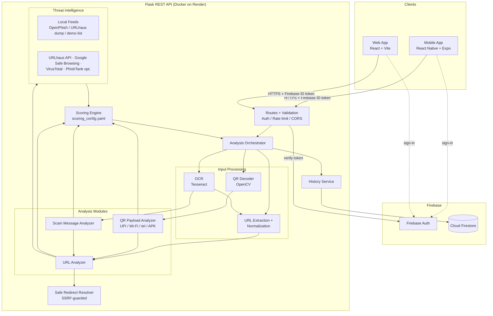
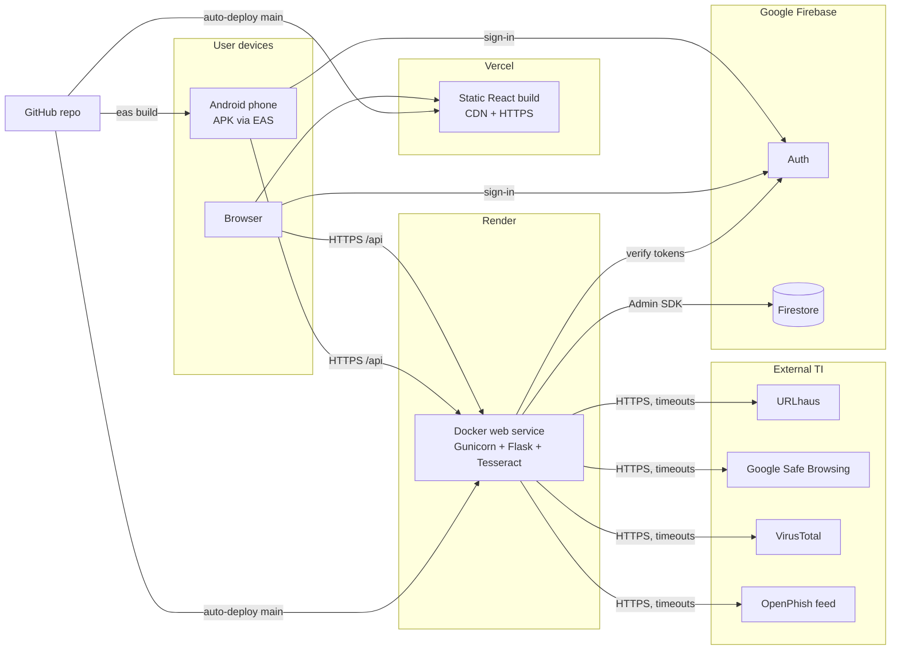
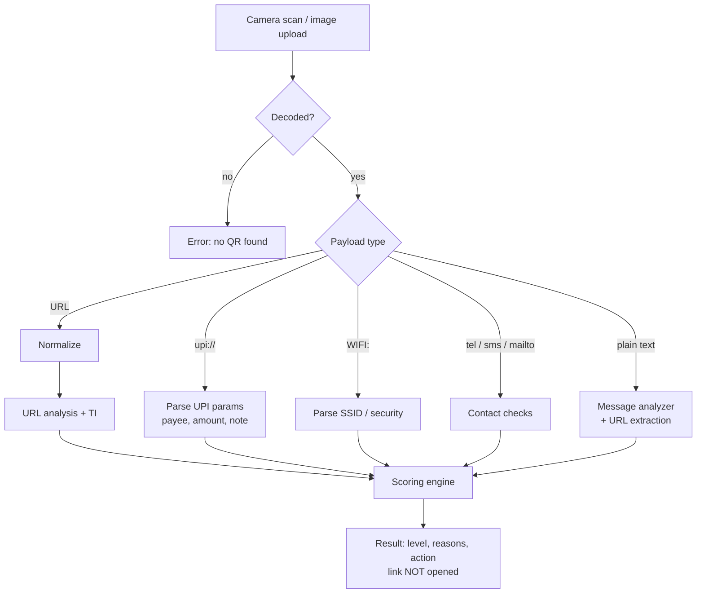
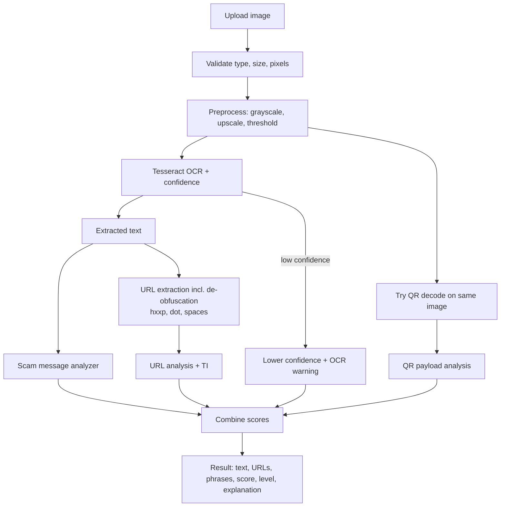

# QRGUARD: System Architecture (Phase 1)

> Status: **approved and implemented** (released as v1.0.0). This document records the design decisions;
> implementation details are in the other `docs/` files and each app's README.

## 1. Final recommended architecture

### 1.1 Key decisions

| # | Decision | Choice | Trade-off / reason |
|---|---|---|---|
| D1 | Where analysis runs | **Backend only** (Flask). Web and mobile are thin clients with **no security logic**. | One implementation shared by web and mobile. Rules and threat-intel keys stay server-side. Cost: analysis needs network access. |
| D2 | Camera QR decode | **On device** (`expo-camera`) and only the decoded string is sent. Decoding is not analysis: the backend classifies the payload type and analyses it. | Fast, and no image upload. |
| D3 | Gallery / screenshot QR decode | **Backend** (OpenCV `QRCodeDetector`) | One decoder for web and mobile. The native library is a `pip` wheel with no system lib to install. |
| D4 | OCR | **Tesseract** on the backend, run in a **Docker** image | Tesseract is a system binary, and Docker is the reliable way to ship it to Render. |
| D5 | QR generation | **On client** (mobile: `react-native-qrcode-svg`; web: `qrcode`). The API endpoint exists for completeness. | Wi-Fi passwords and personal data never leave the device, and the generator works offline. |
| D6 | Database writes | **Backend writes** history via Firebase Admin SDK. Clients read and delete through the API. | Clients cannot forge risk scores. Firestore rules deny all client writes, which keeps them simple. |
| D7 | Authentication | Firebase Auth with **anonymous sign-in by default** and optional email/password upgrade | History works with zero friction. The ID token is verified by the backend. |
| D8 | Detection method | **Rule-based, weighted, explainable** (no ML in MVP) | Explainable, testable and realistic in 3 months. The indicator schema is ML-ready. |
| D9 | Threat intel | Pluggable `ThreatIntelService` with **local feeds first**, then APIs | Local feeds need no per-request call and do not leak user URLs to third parties. APIs are optional and degrade gracefully. |
| D10 | Fetching URLs | **Never fetch page bodies.** Optional redirect-header resolution (HEAD/GET, no body) behind SSRF guard; default: *shortener domains only* | Covers the "shortened URL hides destination" case without turning the server into a proxy. |
| D11 | Language | Backend Python 3.12 (3.11+ supported). Web and mobile use **TypeScript in `strict` mode**. | TS catches API-contract mismatches between four people. Expo and Vite templates default to TS. |
| D12 | Monorepo tooling | **None** (plain folders, each app has its own package manager) | Nothing to learn beyond npm and pip, and fewer build failures. The cost is duplicated TS types, which stay small. |

### 1.2 System architecture diagram



### 1.3 Request lifecycle (all analysis endpoints)

1. **Gateway:** request ID assigned, size limit enforced, rate limit checked, optional Firebase ID
   token verified, JSON/multipart validated.
2. **Input processing:** decode the QR / run OCR / extract URLs, then normalise them.
3. **Analysis modules:** each emits a list of `Indicator` objects. No module decides the final verdict.
4. **Threat intelligence:** providers queried in parallel with a time budget. Each returns
   `listed | not_listed | unavailable | disabled | error`.
5. **Scoring engine:** combines indicators and produces the score, level, confidence, breakdown and
   recommended action.
6. **History (optional):** if the user is authenticated and `save_to_history=true`, privacy-minimised
   metadata is written to Firestore.
7. **Response:** the uniform result schema (see `api-spec.md`).

## 2. Technology stack with justification

| Layer | Technology | Why this one | Alternatives rejected |
|---|---|---|---|
| Backend framework | **Flask 3 + Blueprints**, app factory | Required by spec. Small, and easy for students to read. | FastAPI (good, but the spec says Flask) |
| WSGI server | **Gunicorn** | Standard for production Flask | `flask run` (dev only) |
| Validation | **Pydantic v2** | Declarative request schemas and clear error messages | Marshmallow (more boilerplate) |
| Rate limiting | **Flask-Limiter** (memory; Redis optional) | One decorator per route | Hand-written limiter |
| CORS | **Flask-CORS** with explicit origin allowlist | Simple and explicit | `*` origins (unsafe) |
| URL parsing | `urllib.parse`, **tldextract** (bundled suffix list, no network), `idna` | Correct registrable-domain extraction (`a.b.example.co.in` → `example.co.in`) | Regex-only parsing (buggy) |
| Lookalike detection | **rapidfuzz** (Levenshtein) + homoglyph map | Fast and pure-pip | — |
| QR decode | **opencv-python-headless** (`QRCodeDetector`) | pip wheel with no system lib | pyzbar (needs `libzbar`) |
| OCR | **Tesseract 5** + `pytesseract`, Pillow and OpenCV preprocessing | Required by spec. Free and offline. | Cloud OCR (paid, privacy concerns) |
| QR generation (API) | `qrcode[pil]` | Tiny and pure-Python | — |
| HTTP client | `requests` with a custom SSRF-guarded session | Familiar to students | — |
| Caching | `cachetools.TTLCache` | Protects third-party quotas, needs no infra | Redis (extra service) |
| Firebase | **firebase-admin** (backend), **Firebase JS SDK v10+/v11 modular** (clients) | Official SDKs. The JS SDK works in Expo Go. | React-Native-Firebase (needs dev build) |
| Tests | **pytest**, pytest-cov, **Postman/Newman** | Standard | — |
| Lint/format | **ruff** (Python), **ESLint + Prettier** (TS) | Fast, one tool each | — |
| Web | **React 18/19 + Vite + TypeScript + React Router + Tailwind CSS** | Fast dev server, simple static deploy | Next.js (SSR not needed) |
| Mobile | **Expo (current SDK) + expo-router + TypeScript** | Expo Go for testing, EAS for APKs | Bare RN (harder builds) |
| Mobile libs | `expo-camera`, `expo-image-picker`, `expo-sharing`, `expo-media-library`, `expo-file-system`, `react-native-qrcode-svg`, `react-native-svg`, `@react-native-async-storage/async-storage` | Official or near-official Expo-compatible | — |
| Hosting | **Render** (backend, Docker; no Render-specific code, so it can move to Railway/Fly.io/a VM), **Vercel** (web), **EAS Build** (Android), **Firebase Spark** (free) | Free tiers, GitHub-connected | Railway (trial credit only), Fly.io (card required) |
| CI | **GitHub Actions** with path filters per app | Free for public repos, generous for private | — |

## 3. Mobile architecture

### 3.1 Structure

```
mobile/
├── app/                      # expo-router routes (thin, just render a screen)
│   ├── _layout.tsx           # Root stack, AuthProvider, ThemeProvider, ResultProvider
│   ├── index.tsx             # Splash → redirects to /(tabs)/home
│   ├── (tabs)/_layout.tsx    # Bottom tabs: Home · History · Settings
│   ├── (tabs)/home.tsx
│   ├── (tabs)/history.tsx
│   ├── (tabs)/settings.tsx
│   ├── scan/camera.tsx
│   ├── scan/image.tsx
│   ├── check/url.tsx
│   ├── check/message.tsx
│   ├── check/screenshot.tsx
│   ├── generate.tsx
│   └── result.tsx
├── screens/                  # Screen components (real UI logic lives here)
├── components/               # RiskBadge, IndicatorList, ScoreGauge, OpenLinkGuard, ActionButton…
├── services/                 # api.ts (fetch wrapper), firebase.ts, analysis.ts, history.ts
├── context/                  # AuthContext, ResultContext, ThemeContext
├── utils/                    # format.ts, input limits (no security logic)
├── constants/                # theme.ts (colors, spacing), config.ts (reads EXPO_PUBLIC_*)
├── types/                    # api.ts (mirrors backend result schema)
├── app.config.ts             # Expo config (reads env)
└── eas.json                  # development / preview (APK) / production (AAB)
```

### 3.2 Screens (11)

| # | Screen | Route | Key behaviour |
|---|---|---|---|
| 1 | Splash | `/` | Brand, initialise anonymous auth, health ping |
| 2 | Home dashboard | `/(tabs)/home` | Five large action cards plus the last 3 results |
| 3 | QR Scanner | `/scan/camera` | `CameraView` with `barcodeScannerSettings={{barcodeTypes:['qr']}}`. Debounced so it scans once, sends `content` to `/api/analyze/qr`. **Never auto-opens.** |
| 4 | QR Image Analyzer | `/scan/image` | Image picker, then upload to `/api/analyze/qr` (multipart) |
| 5 | URL Checker | `/check/url` | Text input with paste button |
| 6 | Message Checker | `/check/message` | Multi-line input with a "we don't store message text" notice |
| 7 | Screenshot Analyzer | `/check/screenshot` | Pick image, upload, show extracted text, URLs and phrases |
| 8 | QR Generator | `/generate` | Tabs for Text / URL / Wi-Fi / Email / Phone, preview, save to gallery, share. **Visually separate** (neutral colours, "Utility" label). |
| 9 | Analysis Result | `/result` | Level banner (icon, text and colour), score gauge, "Why?" list, recommended action, threat-intel status, disclaimer, `OpenLinkGuard` |
| 10 | History | `/(tabs)/history` | Paginated list, swipe to delete, "Delete all" |
| 11 | Settings/About | `/(tabs)/settings` | Save-history toggle, theme, backend status, about, disclaimer, privacy, helplines |

### 3.3 Mobile rules

- **OpenLinkGuard:** the only code path that opens external URLs. SAFE shows a confirm dialog with
  the full URL. SUSPICIOUS shows a warning dialog. MALICIOUS offers only "Copy link" by default, and
  opening needs a second explicit confirmation. The app never opens `intent://`, `file://`,
  `javascript:` or `data:` URLs.
- The result is passed through `ResultContext`, not URL params (too large, and it would leak into logs).
- Accessibility: every risk level uses **icon + word + colour** (✅ SAFE, ⚠️ SUSPICIOUS, ⛔ MALICIOUS).
  Minimum 44 pt touch targets, and it supports system font scaling.
- State: React Context and hooks only (no Redux).

## 4. Web architecture

```
web/
├── src/
│   ├── main.tsx, App.tsx, router.tsx
│   ├── pages/        Dashboard, UrlCheck, MessageCheck, ScreenshotCheck, QrImageCheck,
│   │                 QrGenerator, History, About, SecurityTips, Login, admin/AdminDashboard, admin/Reports
│   ├── components/   Layout, NavBar, RiskBadge, ScoreGauge, IndicatorList, ResultCard,
│   │                 FileDropzone, ThreatIntelStatus, Disclaimer, ProtectedRoute, AdminRoute
│   ├── services/     api.ts, firebase.ts, auth.ts
│   ├── hooks/        useAnalysis.ts, useAuth.ts, useHistory.ts
│   ├── types/        api.ts
│   └── utils/        format.ts (no security logic)
├── public/
├── index.html, vite.config.ts, tailwind.config.js, vercel.json
└── .env.example
```

- **Admin (deliberately small):** aggregate stats (scans per day, by level, by input type), a list of
  user-submitted false-positive/negative reports with "mark reviewed", and the status of each
  threat-intel provider. Access is gated by a Firebase **custom claim** `admin: true`, and the
  **backend enforces it** (the UI guard is cosmetic).
- URLs in results are rendered as **plain text**, never as `<a href>`. There is no
  `dangerouslySetInnerHTML` anywhere.
- The QR image decode uses the same backend endpoint as mobile. QR generation happens in the browser.

## 5. Deployment architecture



- **Render free tier** sleeps after about 15 minutes idle, and the first request then takes 30–60 s.
  For the demo day, either warm it up 5 minutes before or switch to the cheapest paid instance for
  that week.
- **Production start command** (inside Docker):
  `gunicorn "app:create_app()" --bind 0.0.0.0:$PORT --workers 2 --threads 4 --timeout 60`
- The Firebase service-account key is stored as a **Render Secret File** and referenced by
  `GOOGLE_APPLICATION_CREDENTIALS`. It is never committed.

## 6. Data flow diagrams (core flows)

### QR analysis



### Screenshot analysis

> Implemented. QR codes inside a screenshot are decoded and analysed too (see `docs/risk-scoring.md`
> §13). OCR text reuses the message pipeline, so there is no separate screenshot scoring (§12).


