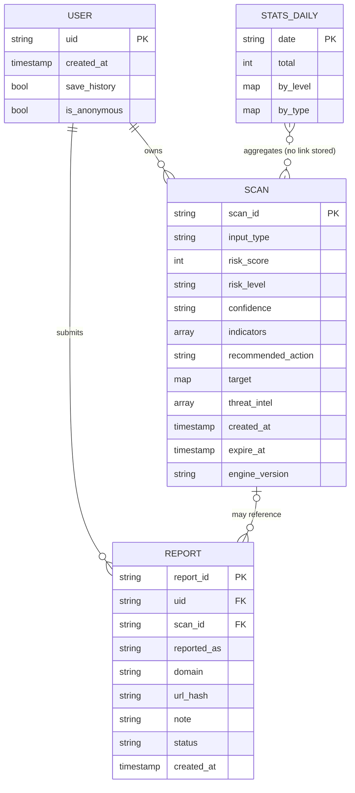

# Database Design (Firebase Auth + Cloud Firestore)

## 1. Privacy principles

1. **Store verdicts, not content.** Raw message text, screenshots, OCR output and Wi-Fi passwords are
   **never** stored. Screenshots are processed in memory and discarded.
2. **URLs are minimised.** We store the **registrable domain** (e.g. `example.co.in`) and a
   **SHA-256 hash** of the normalised URL. The hash allows duplicate detection and admin stats
   without keeping the full path, which can contain tokens or personal IDs.
3. **Opt-in history.** `save_history` defaults to `true` for signed-in users, can be switched off in
   Settings, and every item can be deleted.
4. **Retention.** Each scan has `expire_at` (default +90 days). A Firestore **TTL policy** on that
   field deletes old scans automatically.
5. **Server-only writes.** Only the backend (Admin SDK) writes scans, reports and stats.

## 2. Collections

### `users/{uid}`

| Field | Type | Notes |
|---|---|---|
| `created_at` | timestamp | |
| `save_history` | bool | default `true` |
| `is_anonymous` | bool | mirrors Firebase Auth |

Roles are **not** stored here. Admin rights use Firebase custom claims (`admin: true`), set with a
one-off script, so a user cannot grant themselves admin by editing a document.

### `users/{uid}/scans/{scanId}`

| Field | Type | Example |
|---|---|---|
| `input_type` | string enum | `url` · `message` · `screenshot` · `qr_camera` · `qr_image` |
| `created_at` | timestamp | |
| `expire_at` | timestamp | created_at + `HISTORY_RETENTION_DAYS` |
| `risk_score` | int 0–100 | `72` |
| `risk_level` | string enum | `SAFE` · `SUSPICIOUS` · `MALICIOUS` |
| `confidence` | string enum | `LOW` · `MEDIUM` · `HIGH` |
| `indicators` | array<map> | `[{id:"URL_SHORTENER", category:"url_structure", weight:10, title:"Link uses a URL shortener"}]` (**no evidence strings**) |
| `recommended_action` | string | |
| `target` | map | `{kind:"url", domain:"bit.ly", url_hash:"9f2c…"}` or `{kind:"message", length:212, url_count:1}` or `{kind:"upi", payee_domain:"@okaxis"}` |
| `threat_intel` | array<map> | `[{provider:"urlhaus", status:"not_listed"}]` |
| `engine_version` | string | `0.1.0` (lets us explain why old results differ) |
| `schema_version` | int | `1` |

### `reports/{reportId}` (user-submitted feedback)

| Field | Type | Notes |
|---|---|---|
| `uid` | string | reporter |
| `scan_id` | string? | optional link to their scan |
| `reported_as` | enum | `false_positive` · `false_negative` · `scam` |
| `domain` / `url_hash` | string? | no full URL |
| `note` | string ≤ 280 | the user sees a warning not to include personal data |
| `status` | enum | `open` · `reviewed` |
| `created_at` | timestamp | |

### `stats_daily/{YYYY-MM-DD}` (anonymous aggregates for the admin dashboard)

`{ total: 431, by_level: {SAFE: 300, SUSPICIOUS: 91, MALICIOUS: 40}, by_type: {url: 120, …}, ti_unavailable: 3 }`,
updated with `FieldValue.increment()`. It contains no user IDs.

## 3. ER diagram



## 4. Firestore security rules (defence in depth)

Clients talk to the **API**, not directly to Firestore. The rules still deny anything that bypasses
the API.

```
rules_version = '2';
service cloud.firestore {
  match /databases/{database}/documents {
    function isOwner(uid) { return request.auth != null && request.auth.uid == uid; }

    match /users/{uid} {
      allow read: if isOwner(uid);
      allow create, update: if isOwner(uid)
        && request.resource.data.keys().hasOnly(['created_at', 'save_history', 'is_anonymous']);
      allow delete: if false;

      match /scans/{scanId} {
        allow read, delete: if isOwner(uid);
        allow create, update: if false;      // only the backend (Admin SDK bypasses rules)
      }
    }
    match /reports/{id}        { allow read, write: if false; }
    match /stats_daily/{day}   { allow read, write: if false; }
    match /{document=**}       { allow read, write: if false; }
  }
}
```

They will be tested with the Firebase Emulator in Phase 7 (unauthorised read, cross-user read and
client-side score forgery must all fail).

## 5. Indexes

- `users/{uid}/scans` ordered by `created_at desc`. A single-field index, created automatically.
- `reports` by `status` + `created_at desc`. Composite index in `firestore.indexes.json`.

## 6. Deletion

| Action | Mechanism |
|---|---|
| Delete one scan | `DELETE /api/history/{scan_id}` |
| Delete all history | `DELETE /api/history`, which does batched deletes of 500 |
| Delete account | Settings → "Delete my data", which deletes history, then reports' `uid` field, then the Auth user |
| Automatic | TTL policy on `expire_at` |

## 7. Free-tier fit

On the Spark plan, Firestore allows 50k reads, 20k writes and 20k deletes per day. One analysis costs
about 2 writes (scan + stats). This is comfortably within limits for development and the demo.
