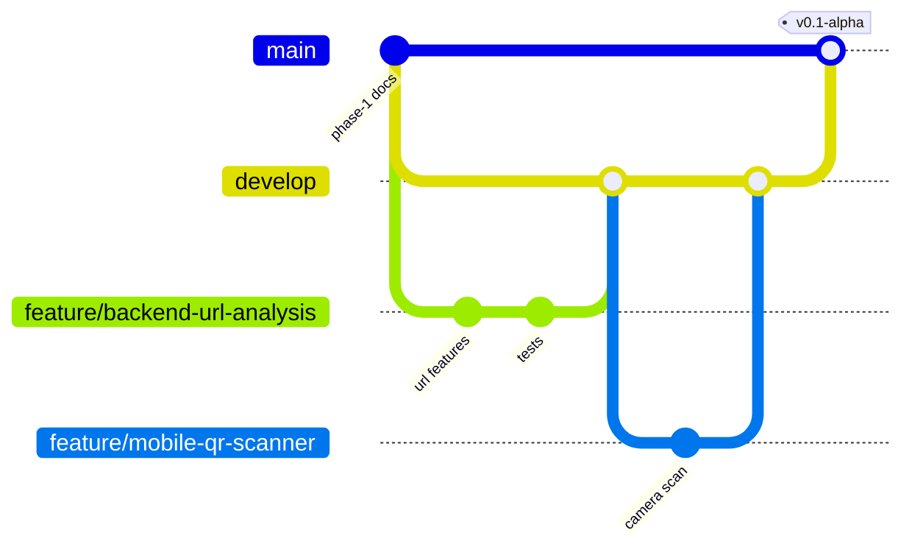

# GitHub Workflow for a 4-Member Team

## 1. Repository setup (M4, Week 1, one time)

> **Status (29 Sep 2026):** `main` and `develop` exist on GitHub. Both were created from the
> completed Phase 4 commit `27d1cbaa0e81ac38af39d62d94493ea21efaee1d`. The earlier development
> branch `claude/qrguard-scam-detection-1lts58` is kept unchanged as history.
> Steps 1, 3, 4 and 5 still need a repository admin in the GitHub web UI (see "Remaining GitHub
> settings" at the end of this section).

1. Create the repository `QRGUARD` on GitHub (private until submission) and add the 3 teammates as
   collaborators with **Write** access.
2. ✅ Create `main` from the approved baseline commit, then `develop` from `main`, and push both.
3. **Settings → Branches → Branch protection** for `main` **and** `develop`:
   - Require a pull request before merging, with **1 approval**
   - Require status checks to pass. Only checks that actually exist can be required. Today that is
     the `test` job of the `backend-ci` workflow. Add `web-ci` / `mobile-ci` checks when those
     workflows are created.
   - Require the branch to be up to date before merging
   - Block force pushes and deletions

   ⚠️ `backend-ci` only runs when files under `backend/` change (path filter). GitHub treats a
   required check that never runs as "pending", so a docs-only PR would be blocked forever. Before
   making `test` required, either remove the `paths:` filter from the `pull_request` trigger, or add
   a small always-running job that reports the same check name.
4. Add `.github/CODEOWNERS` **with the real GitHub usernames** (one path pattern per line; a
   placeholder or unknown username makes the rule invalid):
   ```
   /mobile/                                       @<member1-username>
   /backend/                                      @<member2-username>
   /backend/app/analyzers/message*                @<member3-username>
   /backend/app/analyzers/ocr.py                  @<member3-username>
   /backend/app/analyzers/screenshot_analyzer.py  @<member3-username>
   /backend/app/data/scam_rules.yaml              @<member3-username>
   /web/                                          @<member4-username>
   /firebase/                                     @<member4-username>
   /.github/                                      @<member4-username>
   /docs/api-spec.md                              @<member1-username> @<member2-username> @<member4-username>
   /backend/app/scoring/                          @<member2-username> @<member3-username>
   ```
   Later lines win when several patterns match, so the specific `/backend/app/...` rules come after
   `/backend/`. The file is not in the repository yet because only one collaborator
   (`Spandan314`) is on the repository and the member-to-username mapping is not recorded.
5. Create a **GitHub Project** (board view) with the columns *Backlog · This week · In progress ·
   In review · Done*. Create **milestones** Week 1 … Week 12 and labels:
   `area:mobile`, `area:backend`, `area:scam-ocr`, `area:web`, `area:devops`, `type:bug`,
   `type:feature`, `type:docs`, `security`, `blocked`.

### Remaining GitHub settings (web UI, repository admin)

| Setting | Where |
|---|---|
| Default branch = `develop` | Settings → General → Default branch |
| Automatically delete head branches | Settings → General → Pull Requests |
| Branch protection for `main` and `develop` (step 3) | Settings → Branches (or Rules → Rulesets) |
| Invite the 3 teammates | Settings → Collaborators |
| CODEOWNERS with real usernames (step 4) | Commit via a PR to `develop` |
| Project board, milestones, labels (step 5) | Projects tab; Issues → Milestones / Labels |

## 2. Branch model (agreed)

| Branch | Lifetime | Purpose | Merged by |
|---|---|---|---|
| `main` | permanent | Always demo-ready. Tagged releases. Auto-deploys to Render/Vercel from Phase 9. | M4, via PR from `develop` at milestones |
| `develop` | permanent | Integration branch. All features meet here. | Any member, via a reviewed PR |
| `feature/<area>-<task>` | **1–5 days** | One task / one issue | Author opens PR → `develop`, and the branch is **deleted after merge** |
| `fix/<area>-<task>` | hours–days | Bug fix | same as feature |
| `hotfix/<task>` | hours | Urgent fix on `main` | PR → `main`, then `main` merged back into `develop` |

Example branch names: `feature/backend-url-analysis`, `feature/mobile-qr-scanner`,
`feature/scam-message-detector`, `feature/web-dashboard`, `fix/backend-cors-origin`.



## 3. Exact workflow

### 3.1 One-time setup (M4)

✅ Done: `main` and `develop` were created from `27d1cba` and pushed. For reference:

```bash
git clone https://github.com/Spandan314/QRGUARD.git && cd QRGUARD
git branch main 27d1cbaa0e81ac38af39d62d94493ea21efaee1d && git push origin main
git branch develop main && git push origin develop
```

New clones only need `git checkout develop` to start working.

Still to do on GitHub (admin, web UI): **Settings → General → Default branch = `develop`**, so PRs
target it by default. Also enable **"Automatically delete head branches"** in Settings → General →
Pull Requests, and set up branch protection as described in section 1.

### 3.2 Every task (every member)

```bash
# 1. Start from the latest develop
git checkout develop
git pull origin develop

# 2. Create a short-lived branch for ONE issue
git checkout -b feature/backend-url-analysis

# 3. Work in small commits
git add <files>
git commit -m "feat(backend): detect IP-address hosts in URLs"

# 4. Before pushing, bring in teammates' merged work and re-run your tests
git fetch origin
git merge origin/develop            # resolve any conflicts locally
cd backend && pytest && cd ..       # (or npm test / npm run lint for web/mobile)

# 5. Push and open a PR  (base: develop, compare: your branch)
git push -u origin feature/backend-url-analysis
```

On GitHub:

1. Open a PR with base `develop`. Fill in the template and add `Closes #<issue>`.
2. CI runs automatically, and a CODEOWNER / review partner reviews within 24 h.
3. Fix review comments by pushing more commits to the same branch.
4. When CI is green and the PR is approved, use **Squash and merge**. GitHub deletes the remote branch.
5. Clean up locally:

```bash
git checkout develop
git pull origin develop
git branch -d feature/backend-url-analysis
git fetch --prune                    # forget deleted remote branches
```

### 3.3 Milestone release (M4, end of a milestone)

1. Open a PR from `develop` to `main` titled "Release v0.x".
2. The whole team checks the demo script on `develop`, then uses **Create a merge commit**.
3. Tag the release:

```bash
git checkout main && git pull
git tag -a v0.1-alpha -m "URL analysis end-to-end"
git push origin v0.1-alpha
```

### 3.4 Rules

- Never commit directly to `main` or `develop`. Branch protection enforces this.
- One branch = one task. Don't reuse a merged branch; create a new one.
- Keep PRs under about 400 changed lines. Split big features into several PRs.
- Changes to shared contracts (`docs/api-spec.md`, `backend/app/scoring/*`) need the extra CODEOWNER review.
- Never commit `.env` files, keys, service-account JSON or APKs.

## 4. Pull requests and code review

- The PR template asks: What/Why, How to test, Screenshots (UI), Checklist (tests added, no secrets,
  API spec updated if the contract changed).
- **Reviewer rotation:** M1 ↔ M4 (both frontends), M2 ↔ M3 (both backend analysis). Anything touching
  `api-spec.md` or `scoring/` needs the extra CODEOWNER.
- Review within **24 h**. Comments should be specific ("this regex misses `hxxps`"), not vague.
- Merge with **Squash and merge** into `develop` (clean history), and **Merge commit** from
  `develop` into `main`.
- Delete the feature branch after merging.

## 5. How four people avoid breaking each other

1. **Contract first (Week 1).** `docs/api-spec.md` plus example JSON responses are agreed and frozen.
   The web and mobile teams build against **mock responses** (`services/mockApi.ts`, switched on by
   `USE_MOCK_API=true`) until the real endpoint exists.
2. **Folder ownership + CODEOWNERS.** Members rarely edit the same files.
3. **Shared `Indicator` contract.** M2 and M3 write different analyzers that emit the same object, so
   they don't need to touch each other's code.
4. **CI with path filters.** A mobile PR only runs mobile checks, and a red check blocks the merge.
5. **Small PRs** (< 400 changed lines) merged often.
6. **Weekly integration meeting** (30 min): merge `develop` → `main`, run the end-to-end demo script,
   and update the board.
7. **Feature flags via env** (e.g. `TI_VIRUSTOTAL_ENABLED`) so unfinished work can be merged while
   switched off.

## 6. Issue tracking

Each issue has a title, the acceptance criteria as a checklist, a label, an assignee and a milestone.
Bugs must include reproduction steps and expected vs actual behaviour. Reference issues in commits
(`refs #14`) and in PRs (`Closes #14`).

## 7. Releases

Tag `main` at milestones: `v0.1-alpha` (Week 4: URL analysis end-to-end), `v0.2-beta` (Week 8: all
analyzers), `v1.0-rc` (Week 11), `v1.0` (final submission). Release notes are generated from PR titles.
