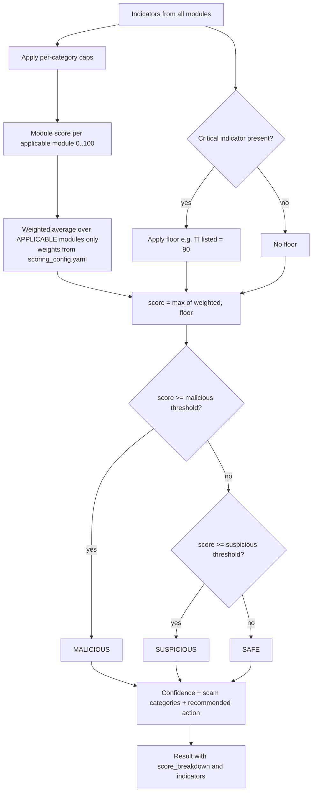

# Risk-Scoring Architecture

## 1. Design goals

1. **Explainable:** every point in the score traces back to a named indicator.
2. **Configurable:** weights, caps, bonuses, floors and thresholds live in one file,
   `scoring/scoring_config.yaml`. They are never hard-coded in analyzers.
3. **Robust to keyword stuffing:** per-category caps stop a single category from dominating, and
   high scores require **independent** evidence types.
4. **Honest:** a confidence value reflects how much evidence was actually available, for example when
   threat intel was down or OCR quality was poor.

## 2. The Indicator contract

```python
@dataclass(frozen=True)
class Indicator:
    id: str            # "URL_IP_HOST"  (stable, used in tests + history)
    category: str      # url_structure | lexical | brand | host | reputation | qr | message_* | ocr
    weight: int        # from scoring_config.yaml (0 for info)
    severity: str      # info | low | medium | high | critical  (derived from weight)
    title: str         # "Link uses an IP address instead of a domain name"
    explanation: str   # plain language, for non-technical users
    evidence: str | None = None   # short snippet; returned to caller, never stored
```

Analyzers **only emit indicators**. They never compute a final verdict.

## 3. Indicator catalogue (initial weights, to be tuned in Week 8)

### URL: structure (category cap 45)

| ID | Condition | Weight |
|---|---|---|
| `URL_DANGEROUS_SCHEME` | `javascript:`, `data:`, `file:`, `intent:` | 60 |
| `URL_IP_HOST` | Host is an IPv4/IPv6 literal (including decimal/hex forms) | 25 |
| `URL_USERINFO_AT` | `@` in authority (`https://bank.com@evil.io`) | 20 |
| `URL_PUNYCODE` | Label starts with `xn--` | 15 |
| `URL_MIXED_SCRIPT` | Decoded IDN mixes scripts (e.g. Latin + Cyrillic) | 25 |
| `URL_NO_HTTPS` | Scheme `http` | 8 |
| `URL_NONSTANDARD_PORT` | Explicit port other than 80/443 | 10 |
| `URL_MANY_SUBDOMAINS` | > 3 labels before the registrable domain | 10 |
| `URL_LONG` | > 100 chars (+5), > 200 (+10) | 5 / 10 |
| `URL_SPECIAL_CHARS` | High ratio of `-_~%=&` | 5 |
| `URL_ENCODED_OBFUSCATION` | `%xx` in host, or excessive encoding in path | 10 |
| `URL_EMBEDDED_URL` | `http` inside path/query (`?next=http://…`) | 10 |
| `URL_SHORTENER` | Host is on `url_shorteners.txt` | 10 |
| `URL_SUSPICIOUS_TLD` | TLD in `suspicious_tlds.txt` (e.g. `zip, mov, top, xyz, click`) | 10 |
| `URL_MANY_HYPHENS` | ≥ 3 hyphens in registrable domain | 5 |
| `URL_APK_DOWNLOAD` | Path ends in `.apk`/`.exe`/`.scr` | 35 |

### URL: lexical and brand (category cap 40)

| ID | Condition | Weight |
|---|---|---|
| `LEX_PHISH_KEYWORDS` | `login, verify, update, secure, kyc, wallet, reward, refund…` in host/path | 5 each, max 15 |
| `BRAND_IN_WRONG_PLACE` | Known brand in a subdomain/path but the registrable domain is not the brand's (`sbi.co.in.kyc-update.xyz`) | 25 |
| `BRAND_LOOKALIKE` | Registrable domain within edit distance ≤ 2 of a brand, or matching after homoglyph normalisation (`paytrn`, `hdfcbnak`) | 30 |
| `TRUSTED_DOMAIN` | Exact registrable-domain match on `trusted_domains.txt`. Excludes user-content hosts such as `sites.google.com`. | −20 (cannot cancel a reputation hit) |

### URL: host (category cap 25, best-effort)

| ID | Condition | Weight |
|---|---|---|
| `HOST_NEW_DOMAIN` | RDAP registration < 30 days (20) or < 180 days (10) | 20 / 10 |
| `HOST_LONG_REDIRECT_CHAIN` | > 3 redirects | 10 |
| `HOST_REDIRECT_CROSS_DOMAIN` | Shortener resolves to a different domain, and the **final URL is re-analysed** | 0 (info) |

### Reputation (threat intelligence)

| ID | Condition | Effect |
|---|---|---|
| `TI_LISTED` | Any provider reports it as listed malicious/phishing | +60 **and score floor 90** |
| `TI_PARTIAL` | e.g. VirusTotal 1–2 engines flag it | +20 |
| `TI_UNAVAILABLE` | All enabled providers failed | 0, lowers confidence |

### QR payload (category cap 35)

| ID | Condition | Weight |
|---|---|---|
| `QR_UPI_PAYMENT` | `upi://pay`. Explains that scanning this **sends** money. | 0 (info) |
| `QR_UPI_PREFILLED_AMOUNT` | `am=` present | 10 |
| `QR_UPI_RECEIVE_CONTEXT` | UPI QR plus text such as "scan to receive / refund / prize" | 30 |
| `QR_UPI_NAME_MISMATCH` | `pn` claims a bank/government brand but the VPA is a personal handle | 15 |
| `QR_WIFI_OPEN` | `WIFI:T:nopass` | 0 (info) |
| `QR_SMS_PREFILLED` | `smsto:` with prefilled body to a short code | 10 |

### Message (category caps shown; negation-aware)

| Category | Examples of patterns (normalised text) | Weight (cap) |
|---|---|---|
| `msg_urgency` | act now, within 24 hours, immediately, last chance, today only | 10 |
| `msg_threat` | account blocked/suspended, legal action, police, electricity will be disconnected | 15 |
| `msg_credential_request` | share/send/tell OTP, PIN, CVV, password, "verify with OTP" | 25 |
| `msg_financial_request` | pay, transfer, registration/processing fee, refundable deposit | 15 |
| `msg_reward` | you have won, lottery, prize, cashback, selected, gift | 15 |
| `msg_impersonation` | bank/RBI/TRAI/customs/courier/KYC/government names | 10 |
| `msg_job_scam` | work from home + earn ₹X/day, like videos, Telegram task, no interview | 15 |
| `msg_investment` | guaranteed returns, double money, trading tips, crypto profit | 15 |
| `msg_remote_access` | AnyDesk, TeamViewer, QuickSupport, "screen share" | 25 |
| `msg_off_platform_contact` | "contact on WhatsApp/Telegram", personal mobile numbers | 5 |
| `msg_style` | ≥ 3 `!!!`, ALL CAPS ratio > 30 % | 5 |
| `msg_security_warning` (legit signal) | "never share your OTP", "bank will never ask" | −10, and suppresses `msg_credential_request` from the same sentence |

**Combination bonuses** (added once, shown as their own line in the "Why?" list):

| Combination | Bonus |
|---|---|
| credential_request + impersonation | +20 |
| reward + financial_request (advance-fee) | +20 |
| job_scam + financial_request | +20 |
| threat + urgency + link | +15 |
| remote_access + impersonation | +20 |

A single keyword cannot exceed its category cap (≤ 25). **No single message category alone can reach
MALICIOUS**, so a MALICIOUS verdict always needs corroborating evidence.

## 4. Combining modules (agreed model: normalised module weights)

All weights and thresholds live in **one file**: `backend/app/scoring/scoring_config.yaml`.

### 4.1 Module weights

| Module | Weight | Produces a score when… |
|---|---|---|
| `url_qr` | 0.35 | the input contains a URL or a QR payload |
| `threat_intel` | 0.30 | at least one provider returns a **positive** finding (`listed` or partial) |
| `message` | 0.20 | there is text to analyse (message input, OCR text, plain-text QR) |
| `ocr` | 0.15 | the input is a screenshot (OCR-specific indicators, e.g. QR inside the screenshot, obfuscated link text) |

### 4.2 Formula

```
applicable = modules that produced a score for this input
module_score(m) = min(100, Σ capped category subtotals in m)      # 0..100

weighted = Σ_{m ∈ applicable} w_m × module_score(m)  /  Σ_{m ∈ applicable} w_m
score    = max(weighted, floors)                                   # see 4.3
score    = round(clamp(score, 0, 100))
```

Dividing by the weights of **applicable** modules only means that an input is never penalised,
or made to look safer, because a module did not apply. A plain URL check is scored on URL evidence
alone. It is not diluted by an absent message or OCR module.

**Why `not_listed` does not count as threat-intel evidence:** if "not on a blacklist" were scored as
0, it would pull every score down and quietly treat absence from a list as proof of safety, which we
have promised not to claim. `not_listed`, `unavailable` and `disabled` therefore make the module
*not applicable*. They are still shown to the user, and they affect **confidence** (section 6).

### 4.3 Floors (strong evidence cannot be averaged away)

A weighted average can hide one decisive finding. Suppose a harmless-looking message contains a link
to a known phishing site. Averaging the link with the harmless text would pull the score down. So a
few **critical indicators** set a minimum score, and the result explains this in its own line:

| Indicator | Floor |
|---|---|
| `TI_LISTED` (known malicious in any provider) | 90 |
| `URL_DANGEROUS_SCHEME` (`javascript:`, `data:`…) | 80 |
| `URL_APK_DOWNLOAD`, `BRAND_LOOKALIKE`, `QR_UPI_RECEIVE_CONTEXT` | 60 (= MALICIOUS threshold) |

Floors are configured in `scoring_config.yaml` together with the indicator weights.

### 4.4 Worked examples

| Input | Module scores | Calculation | Result |
|---|---|---|---|
| URL only, TI `not_listed` | url_qr 48 | 0.35·48 / 0.35 = 48 | 48 → SUSPICIOUS |
| URL, TI `listed` | url_qr 30, TI 100 | (0.35·30 + 0.30·100) / 0.65 = 62, then floor 90 | 90 → MALICIOUS |
| Message with a link | message 40, url_qr 55 | (0.20·40 + 0.35·55) / 0.55 = 49.5 | 50 → SUSPICIOUS |
| Genuine bank SMS, no link | message 0 | 0 / 0.20 = 0 | 0 → SAFE |
| Screenshot: text + link + QR | message 50, url_qr 70, ocr 20 | (0.20·50 + 0.35·70 + 0.15·20) / 0.70 = 53.6 | 54 → SUSPICIOUS |
| Nothing analysable (empty OCR) | none | no applicable module | error `OCR_FAILED`, not "SAFE" |

### 4.5 Explaining the score

Every result includes `score_breakdown`, which gives each applicable module's score, weight and
weighted contribution, plus any floor that applied. The `indicators` list names every contributing
indicator with its weight. The "Why?" list in the apps is built directly from these two fields.

## 5. Levels and thresholds

| Level | Default range | Configured in |
|---|---|---|
| SAFE | 0 – 29 | `scoring_config.yaml` → `thresholds.suspicious: 30` |
| SUSPICIOUS | 30 – 59 | `scoring_config.yaml` → `thresholds.malicious: 60` |
| MALICIOUS | 60 – 100 | |

The file is validated at startup: thresholds must be ordered and the weights must sum to 1.0.
User-facing wording for SAFE is **"No major risks detected"**, always shown with the disclaimer.

## 5a. Scam categories (multi-label)

One input can match **several** categories. Each category has its own rule set, and every category
whose rules reach its minimum evidence level is reported, strongest first.

| ID | Label |
|---|---|
| `phishing` | Phishing |
| `otp_scam` | OTP scam |
| `banking_payment` | Banking / payment scam |
| `upi_scam` | UPI scam |
| `kyc_account_suspension` | KYC / account suspension scam |
| `lottery_prize` | Lottery / prize scam |
| `fake_job` | Fake job scam |
| `fake_internship` | Fake internship scam |
| `investment` | Investment / financial scam |
| `impersonation` | Impersonation scam |
| `fake_customer_support` | Fake customer support scam |
| `credential_theft` | Credential theft |
| `malicious_url` | Malicious / suspicious URL |
| `social_engineering_other` | Other social-engineering scam |

Categories are *labels that explain the result*. The score still comes from the weighted indicators,
so a category is never assigned from a single keyword. Example: "Your SBI KYC expires today, share the
OTP at http://sbi-kyc.example" → `kyc_account_suspension`, `otp_scam`, `impersonation`,
`malicious_url`.

## 6. Confidence

| Confidence | Rule (first match wins) |
|---|---|
| HIGH | `TI_LISTED`; **or** score ≥ 60 with ≥ 3 independent categories; **or** score < 30, ≥ 1 TI provider checked, and no indicators with weight ≥ 10 |
| LOW | All TI providers unavailable **and** score within ±10 of a threshold; **or** OCR quality `poor`; **or** message < 20 characters |
| MEDIUM | everything else |

## 7. Recommended action

`recommendations.py` picks text by **level + dominant category**:

- MALICIOUS + credential → "Do not share OTP, PIN, CVV or passwords. Banks never ask for them. Block the sender."
- Any UPI indicator → "Scanning a QR or entering your UPI PIN only **sends** money. You never need them to receive money."
- MALICIOUS + URL → "Do not open this link. If you already entered details, change your password and contact your bank."
- SUSPICIOUS → "Verify through the official app or website typed by hand, not via this link or number."
- SAFE → "No major risks detected. Stay cautious: automated checks can miss new scams."
- Always, for SUSPICIOUS/MALICIOUS in India: "Report financial fraud at **1930** or **cybercrime.gov.in**."

## 8. Flowchart



## 9. Future ML extension (not in MVP)

The indicator vector (one column per indicator ID) is already a feature vector. Later, a logistic
regression or gradient-boosted model can be trained on it and its output added as one more indicator
(`ML_PHISH_PROB`), so explainability is kept.
