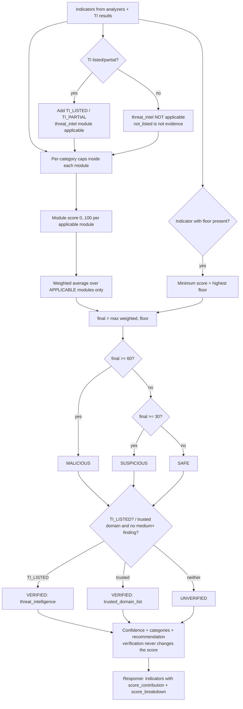

# Risk-Scoring Architecture

> **Status (v0.1.0):** the scoring engine, the URL module and the **scam-message module** are
> implemented (`backend/app/scoring/engine.py`). The OCR and QR-payload indicators in section 3.3
> are the **planned** design for the next phases.
>
> **Single source of truth:** every weight, cap, floor, threshold, category label and indicator
> text lives in `backend/app/scoring/scoring_config.yaml`. The tables below describe the defaults. If
> they ever disagree with the YAML file, the file wins.

## 1. Design goals

1. **Explainable:** every point in the score traces back to a named indicator (`score_contribution`),
   or to a documented floor.
2. **Configurable:** analyzers emit only indicator IDs and never points. All numbers are in one YAML
   file, which is validated at startup.
3. **Robust to keyword stuffing:** per-category caps stop a single kind of evidence from dominating.
4. **Honest:** SAFE means "no significant suspicious indicators detected", never "guaranteed
   safe". Whether a result is backed by a trusted source is reported separately in `verification`.
   Absence from a threat database is not evidence of safety, and confidence drops when checks could
   not be completed.
5. **Scam categories never add points:** they label the result. The score comes from the indicators.

## 2. The Indicator contract

```python
@dataclass(frozen=True)
class Indicator:
    id: str                    # "URL_IP_HOST" (must exist in scoring_config.yaml)
    evidence: str | None = None  # short, user-safe detail, trimmed to 120 characters
```

Each ID's definition in the YAML file gives `module`, `category`, `weight`, optional `floor`,
optional `scam_categories`, and user-facing `title` and `message`. A unit test
(`tests/unit/test_indicator_catalog.py`) fails if the code emits an ID that is not configured.

In the API, each indicator becomes:

```json
{ "id": "URL_IP_HOST", "severity": "high", "title": "Uses an IP address instead of a domain name",
  "message": "The URL uses an IP address instead of a normal domain name. …",
  "evidence": "8.8.8.8", "weight": 25, "score_contribution": 25.0, "module": "url_qr" }
```

`severity` is derived from the weight: ≤0 → info, 1–9 → low, 10–19 → medium, 20–39 → high,
≥40 → critical. Any indicator with a floor is always critical.

## 3. Indicator catalogue

### 3.1 URL / QR module (`url_qr`), implemented

| ID | Condition | Category | Weight | Floor |
|---|---|---|---|---|
| `URL_DANGEROUS_SCHEME` | `javascript:`, `data:`, `vbscript:`, `file:`, `blob:`, `intent:` | url_structure | 60 | **80** |
| `URL_IP_HOST` | Host is an IP address | url_structure | 25 | |
| `URL_OBFUSCATED_IP` | IP written as decimal/hex/octal/short form (`0x7f.1`) | url_structure | 15 | |
| `URL_PRIVATE_NETWORK_HOST` | Private/loopback IP, `localhost`, `.local`, `.internal`…, or a domain resolving to one | url_structure | 15 | |
| `URL_USERINFO_AT` | `@` before the host (`https://bank.com@evil.xyz`) | url_structure | 20 | |
| `URL_NO_HTTPS` | `http://` | url_structure | 8 | |
| `URL_NONSTANDARD_PORT` | Explicit port other than 80/443 | url_structure | 10 | |
| `URL_MANY_SUBDOMAINS` | More than 3 subdomain levels (excluding `www`) | url_structure | 10 | |
| `URL_LONG` / `URL_VERY_LONG` | > 100 / > 200 characters | url_structure | 5 / 10 | |
| `URL_SPECIAL_CHARS` | ≥ 30 % symbols in a URL of 40+ characters | url_structure | 5 | |
| `URL_ENCODED_CHARS` | `%`-encoded host, encoded letters/digits, or ≥ 10 `%xx` | url_structure | 10 | |
| `URL_EMBEDDED_URL` | Another `http(s)://` inside the path/query | url_structure | 10 | |
| `URL_BACKSLASH` | `\` in the address | url_structure | 5 | |
| `URL_SHORTENER` | Known link shortener (`bit.ly`, `tinyurl.com`…) | url_structure | 10 | |
| `URL_SUSPICIOUS_TLD` | TLD often abused (`.xyz`, `.top`, `.zip`…) | url_structure | 10 | |
| `URL_MANY_HYPHENS` | More than 3 hyphens in the domain name | url_structure | 5 | |
| `URL_EXECUTABLE_DOWNLOAD` | Path ends in `.apk`, `.exe`, `.msi`… | url_structure | 35 | |
| `URL_USER_CONTENT_HOST` | Free hosting where anyone can publish (`sites.google.com`, `*.web.app`…) | url_structure | 8 | |
| `URL_PUNYCODE` | International domain (`xn--`) | url_structure | 15 | |
| `URL_MIXED_SCRIPT` | Letters from different alphabets in one label | url_structure | 25 | |
| `URL_SCHEME_ASSUMED` | No `http(s)://` typed | url_structure | 0 (info) | |
| `URL_PHISHING_KEYWORD` | `login`, `verify`, `kyc`, `refund`… (max 3 reported) | lexical | 5 each | |
| `OFFICIAL_DOMAIN_IN_SUBDOMAIN` | `sbi.co.in.kyc-verify.xyz` | brand | 40 | **60** |
| `OFFICIAL_DOMAIN_IN_USERINFO` | `https://www.sbi.co.in@evil.xyz` | brand | 40 | **60** |
| `BRAND_LOOKALIKE` | `paypa1.com`, `hdfcbnak.com`, Cyrillic `аpple.com` | brand | 40 | **60** |
| `BRAND_IN_SUBDOMAIN` | `paytm.secure-login.xyz` | brand | 25 | |
| `BRAND_IN_DOMAIN_NAME` | `sbi-kyc-update.com`, `paytmcashback.in` | brand | 25 | |
| `BRAND_NAME_UNOFFICIAL_DOMAIN` | `paypal.xyz` | brand | 20 | |
| `TRUSTED_DOMAIN` | Registrable domain on the trusted list or a brand's official domain | trust | −20 | |
| `REDIRECT_DANGEROUS_SCHEME` | Redirect to `javascript:` / `intent:`… | redirect | 60 | **80** |
| `REDIRECT_TO_PRIVATE_ADDRESS` | Redirect to a private/internal address (blocked) | redirect | 30 | |
| `REDIRECT_NON_WEB_SCHEME` | Redirect to `upi:`, `ftp:`… | redirect | 15 | |
| `REDIRECT_CHAIN_TOO_LONG` | More than `REDIRECT_MAX_HOPS` redirects | redirect | 15 | |
| `REDIRECT_HTTPS_DOWNGRADE` | https → http during redirects | redirect | 10 | |
| `REDIRECT_BLOCKED_PORT` | Redirect to a non-80/443 port | redirect | 10 | |
| `DOMAIN_NOT_RESOLVING` | Domain has no DNS record | redirect | 5 | |
| `REDIRECT_CROSS_DOMAIN` | Leads to another site (which is then analysed too) | redirect | 0 (info) | |
| `REDIRECT_CHECK_INCOMPLETE` | Timeout / TLS / connection error while checking | redirect | 0 (info), lowers confidence | |

Category caps: url_structure **45**, lexical **15**, brand **40**, redirect **40**.

**Brand rules that protect legitimate sites** (`app/data/brands.yaml`):
- URLs on a brand's official domains are never flagged. Official domains are also trusted.
- Short brand keywords (< 5 letters, e.g. `sbi`) only match whole words, so `sbicard.com` and
  `sbilling.com` are not matched.
- Typo distance applies only to long keywords: 1 edit for ≥ 6 letters, 2 edits for ≥ 9 letters.
- A brand name alone (`BRAND_IN_DOMAIN_NAME`, `BRAND_IN_SUBDOMAIN`, `BRAND_NAME_UNOFFICIAL_DOMAIN`)
  scores 20–25 points. That is below SUSPICIOUS on its own, so it needs other evidence.
  Only structural deception (lookalike characters, or an official domain used as a disguise) carries
  a floor.

### 3.2 Threat intelligence (`threat_intel`), interface implemented, providers later

| ID | Condition | Category | Weight | Floor |
|---|---|---|---|---|
| `TI_LISTED` | Any provider returns `listed` | reputation | 100 | **90** |
| `TI_PARTIAL` | Any provider returns `partial` (no `listed`) | reputation | 50 | |

`not_listed`, `unavailable`, `disabled` and `error` produce **no indicator**. The module is then
*not applicable*, so a clean lookup never pulls the score down toward "safe".

### 3.3 Scam-message module (`message`), implemented

See **section 11** for the full catalogue, the matching rules and the scoring design for messages.

### 3.4 Planned modules (next phases)

**QR payload** (`url_qr`): `QR_UPI_PAYMENT` (info: scanning *sends* money), `QR_UPI_PREFILLED_AMOUNT` 10,
`QR_UPI_RECEIVE_CONTEXT` 30 (floor 60), `QR_UPI_NAME_MISMATCH` 15, `QR_WIFI_OPEN` info, `QR_SMS_PREFILLED` 10.

**OCR** (`ocr`): QR code inside the screenshot, obfuscated link text (`hxxp`, `[.]`). Poor OCR
quality lowers confidence only.

## 4. Combining modules (normalised module weights)

### 4.1 Module weights

| Module | Weight | Applicable when… |
|---|---|---|
| `url_qr` | 0.35 | the input contains a URL or QR payload (always, for `/api/analyze/url`) |
| `threat_intel` | 0.30 | at least one provider returns a **positive** finding (`listed`/`partial`) |
| `message` | 0.20 | there is text to analyse |
| `ocr` | 0.15 | the input is a screenshot |

### 4.2 Formula

```
Step 1  points(i)        = weight(i) × min(1, cap(category) / Σ positive weights in that category)
                           (negative weights are not capped)
Step 2  module_score(m)  = clamp(Σ points in m, 0, 100)
Step 3  weighted         = Σ_{m applicable} w_m × module_score(m)  /  Σ_{m applicable} w_m
Step 4  final            = round(max(weighted, highest floor among present indicators))
```

`score_contribution(i) = points(i) × (module_score / raw module sum) × (w_m / Σ applicable w)`,
so the contributions add up to `weighted_score` (± rounding). A floor is reported separately as
`floor_applied.points_added`.

### 4.3 Floors (configurable, `floor:` in the YAML)

| Indicator | Minimum score | Why |
|---|---|---|
| `TI_LISTED` | 90 | Confirmed by a threat database |
| `URL_DANGEROUS_SCHEME`, `REDIRECT_DANGEROUS_SCHEME` | 80 | Can run code or open apps |
| `BRAND_LOOKALIKE`, `OFFICIAL_DOMAIN_IN_SUBDOMAIN`, `OFFICIAL_DOMAIN_IN_USERINFO` | 60 | Structural impersonation of a known brand |

### 4.4 Worked examples (actual engine output)

| Input | Indicators (points) | Calculation | Result |
|---|---|---|---|
| `https://en.wikipedia.org/wiki/QR_code` | TRUSTED_DOMAIN (−20) | url_qr = clamp(−20) = 0 → 0 | **0, SAFE**, VERIFIED (trusted_domain_list) |
| `https://www.example.com/` | none | 0 | **0, SAFE**, UNVERIFIED |
| `http://8.8.8.8/secure/login` | IP 25, http 8, keywords secure+login 10 | 43 | **43, SUSPICIOUS** |
| `https://hdfcbnak.com/netbanking` | BRAND_LOOKALIKE 40, keyword 5 | 45 → floor 60 | **60, MALICIOUS** |
| `http://sbi.co.in.kyc-verify.xyz/login` | official-in-subdomain 40, .xyz 10, http 8, 3 keywords 15 | 73 (floor 60 not needed) | **73, MALICIOUS** |
| `https://www.example.com/login` + TI `listed` | TI_LISTED 100 (threat_intel), keyword 5 (url_qr) | (0.35×5 + 0.30×100)/0.65 = 48.8 → floor 90 | **90, MALICIOUS**, VERIFIED (threat_intelligence) |
| `http://8.8.8.8/` + TI `partial` | IP 25, http 8; TI_PARTIAL 50 | (0.35×33 + 0.30×50)/0.65 = 40.8 | **41, SUSPICIOUS** |
| Same URL + TI `not_listed` | IP 25, http 8 | TI not applicable → 33 | **33, SUSPICIOUS** (unchanged) |

## 5. Risk levels and verification

### 5.1 Three risk levels (from the score only)

| Level | Score | Meaning |
|---|---|---|
| **SAFE** | 0–29 | **No significant suspicious indicators detected.** This is *not* a guarantee of safety. |
| **SUSPICIOUS** | 30–59 | Several warning signs; do not trust. |
| **MALICIOUS** | 60–100 | Strong or decisive evidence of harm. |

Thresholds come from `thresholds:` in `scoring_config.yaml`. The level depends on the score
**only**.

### 5.2 Verification (separate field, never changes the score)

```json
"verification": { "status": "VERIFIED" | "UNVERIFIED",
                  "source": "trusted_domain_list" | "threat_intelligence" | null,
                  "message": "…" }
```

| Status / source | When | Meaning |
|---|---|---|
| VERIFIED / `threat_intelligence` | `TI_LISTED` present | A threat-intelligence source confirms the input is known malicious |
| VERIFIED / `trusted_domain_list` | `TRUSTED_DOMAIN` present **and** no finding of `medium` severity or worse | The domain is on the curated trusted list (`trusted_domains` + brand official domains) |
| UNVERIFIED / `null` | otherwise | Insufficient evidence to establish trust |

Rules (configured in `verification:`):
- "Not found in a threat database" (`not_listed`) **never** verifies anything.
- `partial` threat-intel results do not verify either; they add points but are not a confirmation.
- After a redirect, trust is judged on the **final destination**. For `bit.ly` → `wikipedia.org`,
  the shortener is a medium finding, so the result is SAFE + UNVERIFIED.
- Verification affects the wording and the confidence, never `risk_score` or `risk_level`.

### 5.3 How the combinations are communicated

| Result | Summary shown to the user |
|---|---|
| SAFE + VERIFIED | "No significant suspicious indicators detected, and the domain is on QRGUARD's list of recognised websites." |
| SAFE + UNVERIFIED | "No significant suspicious indicators detected. The link could not be verified, so this does not guarantee that the website is safe." |
| SUSPICIOUS (any) | "Several warning signs were found. Treat this link as suspicious." |
| MALICIOUS + VERIFIED (threat_intelligence) | "Strong warning signs…" plus verification message "A threat-intelligence source lists this as known malicious." |

Suggested UI:

```
✅ SAFE                         Risk Score: 0/100
No significant suspicious indicators detected.
Verification: UNVERIFIED — this does NOT guarantee that the website is safe.

⛔ MALICIOUS                    Risk Score: 90/100
Verification: THREAT INTELLIGENCE — known malicious indicator detected.
```

## 6. Scam categories (multi-label, never scored)

There are 14 labels (`scam_categories` in the YAML). An indicator can list the labels it supports.
The result reports every label from contributing indicators, strongest first, **only when the
level is SUSPICIOUS or MALICIOUS**. A lone weak signal therefore never gets a scary label.

| ID | Label |
|---|---|
| `phishing` | Phishing |
| `otp_scam` | OTP scam |
| `banking_payment` | Banking / payment scam |
| `upi_scam` | UPI scam |
| `kyc_account_suspension` | KYC / account suspension scam |
| `lottery_prize` | Lottery / prize scam |
| `fake_job` | Fake job scam |
| `fake_internship` | Fake internship scam |
| `investment` | Investment / financial scam |
| `impersonation` | Impersonation scam |
| `fake_customer_support` | Fake customer support scam |
| `credential_theft` | Credential theft |
| `malicious_url` | Malicious / suspicious URL |
| `social_engineering_other` | Other social-engineering scam |

## 7. Confidence

| Confidence | Rule (first match wins) |
|---|---|
| HIGH | `TI_LISTED` present; **or** a floor was applied; **or** MALICIOUS with ≥ 3 different positive categories |
| LOW | Some check could not be completed (redirect timeout, DNS failure, TLS/connection error); **or** SAFE + UNVERIFIED with no definitive threat-intel answer |
| MEDIUM | everything else (e.g. SAFE + VERIFIED by the trusted list, or SAFE + UNVERIFIED after a clean TI lookup) |

## 8. Recommended action

`app/scoring/recommendations.py` combines:

- a base text per level (MALICIOUS: do not open, do not enter OTP/PIN/payment details, contact your
  bank if you already did; SUSPICIOUS: use the official app or type the address yourself;
  SAFE + UNVERIFIED: only if you trust the sender, never enter OTPs/PINs from a received link;
  SAFE + VERIFIED: stay cautious),
- one piece of extra advice for the strongest evidence type (brand impersonation, app download,
  hidden destination),
- for SUSPICIOUS/MALICIOUS: *"In India, report financial fraud at 1930 or https://cybercrime.gov.in."*

## 9. Flowchart



## 11. Scam messages (implemented)

Files: `app/data/scam_rules.yaml` (patterns, order, combinations), `app/scoring/scoring_config.yaml`
(`MSG_*` weights, groups, categories, text), `app/analyzers/text_preprocessor.py`,
`app/analyzers/message_analyzer.py`, `app/services/message_analysis_service.py`.

### 11.1 Design decision: the message text is primary evidence, links are additional evidence

> **A link inside a message may increase the risk score, but it can never reduce it.**

```
final_score = max( text_score,                              # message module alone
                   applicable_weighted_score,               # message 0.20 + link 0.35 (+ TI 0.30)
                   minimum_score_rules )                    # floors, e.g. TI listed 90, look-alike 60
```

Why: with a plain weighted average, a clearly scammy text (message = 80) containing an ordinary
link (link = 0) would score (0.20×80 + 0.35×0) / 0.55 = **29 → SAFE**. That would treat "no
evidence in the link" as evidence of safety, the same mistake we ruled out for threat intelligence.

| Case | Text | Link | Weighted | Final | Rule used |
|---|---|---|---|---|---|
| Scam text, clean link | 80 | 0 | 29.1 | **80** | `primary_evidence` |
| Fake KYC (demo) | 65 | 58 | 60.5 | **65** | `primary_evidence` |
| "Reward points expire today. Redeem: https://hdfcbnak.com/…" | 20 | 45 (+ floor 60) | 35.9 | **60** | `weighted_with_additional_evidence` + floor |
| Text 40, link 75 | 40 | 75 | 62.3 | **62** | `weighted_with_additional_evidence` |
| Any text + TI-listed link | — | — | — | **≥ 90** | floor |

The module weights are unchanged. They decide how much a *risky* link can raise the score, and
never let a clean link lower it. `score_breakdown` shows `primary_score`, `weighted_score`,
`rule_used`, `floor_applied`, and the points per evidence source.

### 11.2 Four kinds of evidence, shown separately

Every indicator in the response has a `source`, and `score_breakdown.sources` sums the points per
source:

| `source` | What it is | Examples |
|---|---|---|
| `message` | Phrases in the text | `MSG_OTP_REQUEST`, `MSG_ACCOUNT_THREAT`, `MSG_BANK_REFERENCE` |
| `link` | Findings from the URL analyzer for the riskiest link | `BRAND_LOOKALIKE`, `URL_SUSPICIOUS_TLD` |
| `threat_intelligence` | Reputation results | `TI_LISTED`, `TI_PARTIAL` |
| `combination` | Rules that need several kinds of message evidence together | `MSG_COMBO_ADVANCE_FEE` |

When the text score wins, link indicators are still listed (for explanation) with
`score_contribution: 0`. Their scam categories are then not reported, because they did not
count.

### 11.3 How double counting is prevented

1. **Links are removed from the text** before the message rules run (they become the word
   `qrglink`). A word inside a URL is judged only by the URL analyzer.
2. **One piece of text supports one indicator.** Rules are tried in priority order (strongest first
   in `scam_rules.yaml`). A later match that overlaps words already used is ignored. For example,
   "pay processing fee ₹12,500" counts as `MSG_UPFRONT_FEE` only, not also as `MSG_PAYMENT_REQUEST`,
   and "enter your UPI PIN to receive" counts as `MSG_UPI_PIN_TO_RECEIVE` only, not also as
   `MSG_CREDENTIAL_REQUEST`.
3. **Each indicator counts once**, however many times its words appear ("urgent urgent urgent" = 10).
4. **Only the riskiest link is scored.** Up to 3 links are analysed; the others are listed but add
   nothing.
5. **Links combine with `max`, never `+`** (section 11.1).
6. **Threat intelligence becomes one indicator** (`TI_LISTED` or `TI_PARTIAL`), whatever the number
   of providers.
7. **Group caps** limit each kind of evidence (pressure 20, credential 40, financial 30, pretext 20,
   lure 25, impersonation 20, contact 10, link 10, style 10, combination 40).

Combination indicators are deliberate *interaction* evidence: "OTP request + bank" is more
dangerous than either alone. They are separate lines in the "Why?" list, fire at most once each,
and are capped at 40 in total.

### 11.4 Keyword safety and negation

- The largest single message indicator is 30 and the largest group cap is 40, so **no single keyword
  or group can make a message MALICIOUS**. The message module has no floors. Only explicit requests
  (OTP, password/PIN/CVV, UPI PIN to receive) reach SUSPICIOUS on their own. Tests check this for
  every indicator.
- **Negation:** a request is ignored when "never / do not / don't / not / won't …" appears in the 3
  words before it (same clause) or inside it. Genuine advice ("Never share your OTP", "Bank will
  never ask for your PIN", "If not done by you, call…", "You don't need to pay any fee") is matched
  first by `MSG_SECURITY_ADVICE` (−10), which claims those words. Negation does **not** leak across
  sentences or clauses: "Do not delay. Share the OTP now." and "Don't worry, just share the OTP" are
  still requests.

### 11.5 Text preprocessing

1. Control characters removed; invisible characters (zero-width, bidirectional controls, soft
   hyphen) counted and removed. Their presence → `MSG_HIDDEN_CHARACTERS`.
2. Unicode NFKC (`ＯＴＰ`, `𝐎𝐓𝐏` → `OTP`).
3. De-obfuscation of defanged links (`hxxps://`, `[.]`, `(dot)`, `[:]`), then link extraction:
   `http(s)://`, `www.`, and bare domains validated against the bundled Public Suffix List.
4. Entities replaced by placeholders: e-mails, UPI IDs (`name@handle`), amounts (`₹`, `Rs`,
   `INR`, lakh/crore), Indian mobile and toll-free numbers (masked in the response).
5. Look-alike letters folded, lower-cased, leetspeak folded only *inside* words (`0TP` → `otp`,
   `p@ssw0rd` → `password`, while `OTP 482913`, `24hrs`, `3pm` stay unchanged).
6. Repeated letters collapsed (`urgentttt` → `urgentt`), spaces normalised, split into sentences.
7. More than 30 % non-Latin letters → `MSG_LANGUAGE_NOT_SUPPORTED` (info) and LOW confidence.

### 11.6 Verification and confidence for messages

- A message is **VERIFIED only by threat intelligence** (a link in it is listed as malicious). A
  trusted-domain link is evidence about the domain, not proof that the message is genuine, so it
  never verifies a message.
- SAFE + UNVERIFIED is the normal result for a genuine message: "No significant suspicious
  indicators detected. This does not guarantee that the message is genuine."
- Confidence is LOW for very short messages (< 20 characters), unsupported languages, or when a
  link's destination could not be checked. SAFE + UNVERIFIED alone does not make a message LOW
  confidence (unlike a URL check).

### 11.7 Evaluation on the labelled demo set (`demo-data/messages.yaml`)

39 messages (DEMO / TEST DATA): 14 genuine, 25 scams, covering all 13 specific categories.

| Result | Count |
|---|---|
| Genuine messages scored SAFE | **14 / 14** (highest score 15) |
| Scams scored SUSPICIOUS or MALICIOUS | **25 / 25** |
| Scams matching the expected level (after the 3 calibration notes below) | 25 / 25 |

**Calibration candidates (honest note):** before running, I expected MALICIOUS for 3 scams that
the rules score as SUSPICIOUS. The rules were **not** bent to fit them; they are recorded in the file
with `calibration_note` for Week 8 tuning on a larger set:
- `scam-job-wfh` (55): one lure + fee + combination.
- `scam-credentials` (45): credential request + threat, no brand named.
- `scam-defanged-link` (48): brand-in-domain link, no KYC pretext.

The lottery-with-fee example scores 50 (SUSPICIOUS), not the 65 predicted in the proposal. The
proposal had counted "pay processing fee" as both a fee and a payment request, and the
double-counting guard now prevents that.

This set is small and was written by us, so these numbers show consistency with the design, **not**
real-world accuracy.

### 11.8 Known limitations of the message detector

- **English-first rules.** Patterns cover English (with common Indian terms such as KYC, UPI, PAN
  and Aadhaar). Hindi, Marathi and other scripts get `MSG_LANGUAGE_NOT_SUPPORTED`, usually score
  SAFE, and are reported with LOW confidence. Warning signs in those languages are missed.
  Hinglish written in Latin script is only partly covered.
- **Rule-based detection.** Only patterns written in `scam_rules.yaml` are recognised. Reworded or
  brand-new scam scripts can be missed (false negatives). Unusual genuine wording can trigger
  a rule (false positives). There is no machine learning in this version.
- **Small demo dataset.** The 39 labelled messages in `demo-data/messages.yaml` were written by the
  team. They check consistency with the design, not real-world accuracy. Three scams score
  SUSPICIOUS where MALICIOUS was expected (section 11.7). They are deliberately not tuned.
- **Threat-intelligence APIs are not connected yet.** Links in messages are judged by URL
  structure only. The `threat_intel` block of every response states this. VERIFIED is therefore
  not reachable for messages until providers are added.
- **Negation limitations.** A request is only treated as negated when the negation word is within the
  3 words before it (same clause) or inside the matched phrase, or when a
  `MSG_SECURITY_ADVICE` pattern covers the sentence. Longer or indirect negations ("You should
  never, under any circumstances, share …") may still be read as a request. Sarcasm and double
  negatives are not understood.
- **Presence of any link.** The "link call-to-action" and "threat + urgency + link" rules react to
  there *being* a link to act on. So even a trusted link can add message-side points, but it can
  never lower the score (section 11.1).

## 10. Future ML extension (not in MVP)

The indicator vector (one column per indicator ID) is already a feature vector. A future model (for
example logistic regression) can be trained on it and added as one more indicator
(`ML_PHISH_PROB`) with its own configured weight, so explainability is kept.
