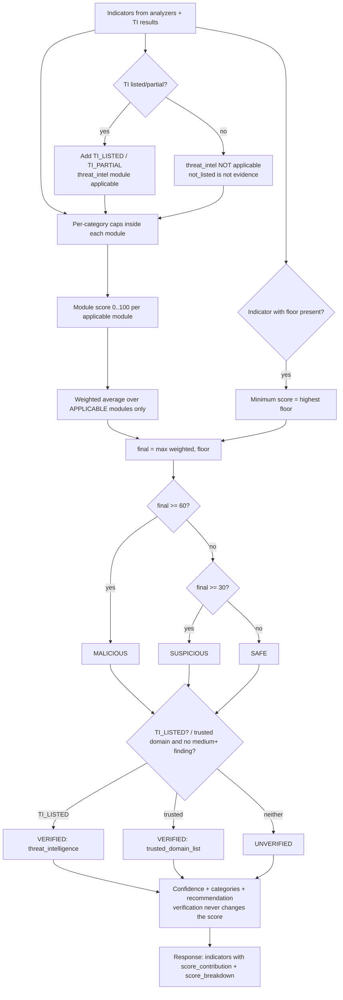

# Risk-Scoring Architecture

> **Status (v0.1.0):** the scoring engine and the URL module are implemented
> (`backend/app/scoring/engine.py`). The message, OCR and QR-payload indicators in section 3.3 are
> the **planned** design for the next phases.
>
> **Single source of truth:** every weight, cap, floor, threshold, category label and indicator
> text lives in `backend/app/scoring/scoring_config.yaml`. The tables below describe the defaults. If
> they ever disagree with the YAML file, the file wins.

## 1. Design goals

1. **Explainable:** every point in the score traces back to a named indicator (`score_contribution`),
   or to a documented floor.
2. **Configurable:** analyzers emit only indicator IDs and never points. All numbers are in one YAML
   file, which is validated at startup.
3. **Robust to keyword stuffing:** per-category caps stop a single kind of evidence from dominating.
4. **Honest:** SAFE means "no significant suspicious indicators detected", never "guaranteed
   safe". Whether a result is backed by a trusted source is reported separately in `verification`.
   Absence from a threat database is not evidence of safety, and confidence drops when checks could
   not be completed.
5. **Scam categories never add points:** they label the result. The score comes from the indicators.

## 2. The Indicator contract

```python
@dataclass(frozen=True)
class Indicator:
    id: str                    # "URL_IP_HOST" (must exist in scoring_config.yaml)
    evidence: str | None = None  # short, user-safe detail, trimmed to 120 characters
```

Each ID's definition in the YAML file gives `module`, `category`, `weight`, optional `floor`,
optional `scam_categories`, and user-facing `title` and `message`. A unit test
(`tests/unit/test_indicator_catalog.py`) fails if the code emits an ID that is not configured.

In the API, each indicator becomes:

```json
{ "id": "URL_IP_HOST", "severity": "high", "title": "Uses an IP address instead of a domain name",
  "message": "The URL uses an IP address instead of a normal domain name. …",
  "evidence": "8.8.8.8", "weight": 25, "score_contribution": 25.0, "module": "url_qr" }
```

`severity` is derived from the weight: ≤0 → info, 1–9 → low, 10–19 → medium, 20–39 → high,
≥40 → critical. Any indicator with a floor is always critical.

## 3. Indicator catalogue

### 3.1 URL / QR module (`url_qr`), implemented

| ID | Condition | Category | Weight | Floor |
|---|---|---|---|---|
| `URL_DANGEROUS_SCHEME` | `javascript:`, `data:`, `vbscript:`, `file:`, `blob:`, `intent:` | url_structure | 60 | **80** |
| `URL_IP_HOST` | Host is an IP address | url_structure | 25 | |
| `URL_OBFUSCATED_IP` | IP written as decimal/hex/octal/short form (`0x7f.1`) | url_structure | 15 | |
| `URL_PRIVATE_NETWORK_HOST` | Private/loopback IP, `localhost`, `.local`, `.internal`…, or a domain resolving to one | url_structure | 15 | |
| `URL_USERINFO_AT` | `@` before the host (`https://bank.com@evil.xyz`) | url_structure | 20 | |
| `URL_NO_HTTPS` | `http://` | url_structure | 8 | |
| `URL_NONSTANDARD_PORT` | Explicit port other than 80/443 | url_structure | 10 | |
| `URL_MANY_SUBDOMAINS` | More than 3 subdomain levels (excluding `www`) | url_structure | 10 | |
| `URL_LONG` / `URL_VERY_LONG` | > 100 / > 200 characters | url_structure | 5 / 10 | |
| `URL_SPECIAL_CHARS` | ≥ 30 % symbols in a URL of 40+ characters | url_structure | 5 | |
| `URL_ENCODED_CHARS` | `%`-encoded host, encoded letters/digits, or ≥ 10 `%xx` | url_structure | 10 | |
| `URL_EMBEDDED_URL` | Another `http(s)://` inside the path/query | url_structure | 10 | |
| `URL_BACKSLASH` | `\` in the address | url_structure | 5 | |
| `URL_SHORTENER` | Known link shortener (`bit.ly`, `tinyurl.com`…) | url_structure | 10 | |
| `URL_SUSPICIOUS_TLD` | TLD often abused (`.xyz`, `.top`, `.zip`…) | url_structure | 10 | |
| `URL_MANY_HYPHENS` | More than 3 hyphens in the domain name | url_structure | 5 | |
| `URL_EXECUTABLE_DOWNLOAD` | Path ends in `.apk`, `.exe`, `.msi`… | url_structure | 35 | |
| `URL_USER_CONTENT_HOST` | Free hosting where anyone can publish (`sites.google.com`, `*.web.app`…) | url_structure | 8 | |
| `URL_PUNYCODE` | International domain (`xn--`) | url_structure | 15 | |
| `URL_MIXED_SCRIPT` | Letters from different alphabets in one label | url_structure | 25 | |
| `URL_SCHEME_ASSUMED` | No `http(s)://` typed | url_structure | 0 (info) | |
| `URL_PHISHING_KEYWORD` | `login`, `verify`, `kyc`, `refund`… (max 3 reported) | lexical | 5 each | |
| `OFFICIAL_DOMAIN_IN_SUBDOMAIN` | `sbi.co.in.kyc-verify.xyz` | brand | 40 | **60** |
| `OFFICIAL_DOMAIN_IN_USERINFO` | `https://www.sbi.co.in@evil.xyz` | brand | 40 | **60** |
| `BRAND_LOOKALIKE` | `paypa1.com`, `hdfcbnak.com`, Cyrillic `аpple.com` | brand | 40 | **60** |
| `BRAND_IN_SUBDOMAIN` | `paytm.secure-login.xyz` | brand | 25 | |
| `BRAND_IN_DOMAIN_NAME` | `sbi-kyc-update.com`, `paytmcashback.in` | brand | 25 | |
| `BRAND_NAME_UNOFFICIAL_DOMAIN` | `paypal.xyz` | brand | 20 | |
| `TRUSTED_DOMAIN` | Registrable domain on the trusted list or a brand's official domain | trust | −20 | |
| `REDIRECT_DANGEROUS_SCHEME` | Redirect to `javascript:` / `intent:`… | redirect | 60 | **80** |
| `REDIRECT_TO_PRIVATE_ADDRESS` | Redirect to a private/internal address (blocked) | redirect | 30 | |
| `REDIRECT_NON_WEB_SCHEME` | Redirect to `upi:`, `ftp:`… | redirect | 15 | |
| `REDIRECT_CHAIN_TOO_LONG` | More than `REDIRECT_MAX_HOPS` redirects | redirect | 15 | |
| `REDIRECT_HTTPS_DOWNGRADE` | https → http during redirects | redirect | 10 | |
| `REDIRECT_BLOCKED_PORT` | Redirect to a non-80/443 port | redirect | 10 | |
| `DOMAIN_NOT_RESOLVING` | Domain has no DNS record | redirect | 5 | |
| `REDIRECT_CROSS_DOMAIN` | Leads to another site (which is then analysed too) | redirect | 0 (info) | |
| `REDIRECT_CHECK_INCOMPLETE` | Timeout / TLS / connection error while checking | redirect | 0 (info), lowers confidence | |

Category caps: url_structure **45**, lexical **15**, brand **40**, redirect **40**.

**Brand rules that protect legitimate sites** (`app/data/brands.yaml`):
- URLs on a brand's official domains are never flagged. Official domains are also trusted.
- Short brand keywords (< 5 letters, e.g. `sbi`) only match whole words, so `sbicard.com` and
  `sbilling.com` are not matched.
- Typo distance applies only to long keywords: 1 edit for ≥ 6 letters, 2 edits for ≥ 9 letters.
- A brand name alone (`BRAND_IN_DOMAIN_NAME`, `BRAND_IN_SUBDOMAIN`, `BRAND_NAME_UNOFFICIAL_DOMAIN`)
  scores 20–25 points. That is below SUSPICIOUS on its own, so it needs other evidence.
  Only structural deception (lookalike characters, or an official domain used as a disguise) carries
  a floor.

### 3.2 Threat intelligence (`threat_intel`), interface implemented, providers later

| ID | Condition | Category | Weight | Floor |
|---|---|---|---|---|
| `TI_LISTED` | Any provider returns `listed` | reputation | 100 | **90** |
| `TI_PARTIAL` | Any provider returns `partial` (no `listed`) | reputation | 50 | |

`not_listed`, `unavailable`, `disabled` and `error` produce **no indicator**. The module is then
*not applicable*, so a clean lookup never pulls the score down toward "safe".

### 3.3 Planned modules (next phases)

**QR payload** (`url_qr`): `QR_UPI_PAYMENT` (info: scanning *sends* money), `QR_UPI_PREFILLED_AMOUNT` 10,
`QR_UPI_RECEIVE_CONTEXT` 30 (floor 60), `QR_UPI_NAME_MISMATCH` 15, `QR_WIFI_OPEN` info, `QR_SMS_PREFILLED` 10.

**Message** (`message`, negation-aware):

| Category | Examples of patterns (normalised text) | Weight (cap) |
|---|---|---|
| urgency | act now, within 24 hours, immediately, last chance | 10 |
| threat | account blocked/suspended, legal action, police, electricity disconnected | 15 |
| credential request | share/send OTP, PIN, CVV, password | 25 |
| financial request | pay, transfer, registration/processing fee, refundable deposit | 15 |
| reward | you have won, lottery, prize, cashback, selected | 15 |
| impersonation | bank/RBI/TRAI/customs/courier/KYC/government names | 10 |
| job scam | work from home + earn ₹X/day, like videos, Telegram task, no interview | 15 |
| investment | guaranteed returns, double money, trading tips | 15 |
| remote access | AnyDesk, TeamViewer, QuickSupport, screen share | 25 |
| off-platform contact | "contact on WhatsApp/Telegram", personal numbers | 5 |
| style | ≥ 3 `!!!`, ALL-CAPS ratio > 30 % | 5 |
| security warning (legit signal) | "never share your OTP", "bank will never ask" | −10, and suppresses credential request in the same sentence |

Combination bonuses (credential + impersonation, reward + fee, job + fee, threat + urgency + link,
remote access + impersonation) will be separate indicators, so they appear in the "Why?" list.

**OCR** (`ocr`): QR code inside the screenshot, obfuscated link text (`hxxp`, `[.]`). Poor OCR
quality lowers confidence only.

## 4. Combining modules (normalised module weights)

### 4.1 Module weights

| Module | Weight | Applicable when… |
|---|---|---|
| `url_qr` | 0.35 | the input contains a URL or QR payload (always, for `/api/analyze/url`) |
| `threat_intel` | 0.30 | at least one provider returns a **positive** finding (`listed`/`partial`) |
| `message` | 0.20 | there is text to analyse |
| `ocr` | 0.15 | the input is a screenshot |

### 4.2 Formula

```
Step 1  points(i)        = weight(i) × min(1, cap(category) / Σ positive weights in that category)
                           (negative weights are not capped)
Step 2  module_score(m)  = clamp(Σ points in m, 0, 100)
Step 3  weighted         = Σ_{m applicable} w_m × module_score(m)  /  Σ_{m applicable} w_m
Step 4  final            = round(max(weighted, highest floor among present indicators))
```

`score_contribution(i) = points(i) × (module_score / raw module sum) × (w_m / Σ applicable w)`,
so the contributions add up to `weighted_score` (± rounding). A floor is reported separately as
`floor_applied.points_added`.

### 4.3 Floors (configurable, `floor:` in the YAML)

| Indicator | Minimum score | Why |
|---|---|---|
| `TI_LISTED` | 90 | Confirmed by a threat database |
| `URL_DANGEROUS_SCHEME`, `REDIRECT_DANGEROUS_SCHEME` | 80 | Can run code or open apps |
| `BRAND_LOOKALIKE`, `OFFICIAL_DOMAIN_IN_SUBDOMAIN`, `OFFICIAL_DOMAIN_IN_USERINFO` | 60 | Structural impersonation of a known brand |

### 4.4 Worked examples (actual engine output)

| Input | Indicators (points) | Calculation | Result |
|---|---|---|---|
| `https://en.wikipedia.org/wiki/QR_code` | TRUSTED_DOMAIN (−20) | url_qr = clamp(−20) = 0 → 0 | **0, SAFE**, VERIFIED (trusted_domain_list) |
| `https://www.example.com/` | none | 0 | **0, SAFE**, UNVERIFIED |
| `http://8.8.8.8/secure/login` | IP 25, http 8, keywords secure+login 10 | 43 | **43, SUSPICIOUS** |
| `https://hdfcbnak.com/netbanking` | BRAND_LOOKALIKE 40, keyword 5 | 45 → floor 60 | **60, MALICIOUS** |
| `http://sbi.co.in.kyc-verify.xyz/login` | official-in-subdomain 40, .xyz 10, http 8, 3 keywords 15 | 73 (floor 60 not needed) | **73, MALICIOUS** |
| `https://www.example.com/login` + TI `listed` | TI_LISTED 100 (threat_intel), keyword 5 (url_qr) | (0.35×5 + 0.30×100)/0.65 = 48.8 → floor 90 | **90, MALICIOUS**, VERIFIED (threat_intelligence) |
| `http://8.8.8.8/` + TI `partial` | IP 25, http 8; TI_PARTIAL 50 | (0.35×33 + 0.30×50)/0.65 = 40.8 | **41, SUSPICIOUS** |
| Same URL + TI `not_listed` | IP 25, http 8 | TI not applicable → 33 | **33, SUSPICIOUS** (unchanged) |

## 5. Risk levels and verification

### 5.1 Three risk levels (from the score only)

| Level | Score | Meaning |
|---|---|---|
| **SAFE** | 0–29 | **No significant suspicious indicators detected.** This is *not* a guarantee of safety. |
| **SUSPICIOUS** | 30–59 | Several warning signs; do not trust. |
| **MALICIOUS** | 60–100 | Strong or decisive evidence of harm. |

Thresholds come from `thresholds:` in `scoring_config.yaml`. The level depends on the score
**only**.

### 5.2 Verification (separate field, never changes the score)

```json
"verification": { "status": "VERIFIED" | "UNVERIFIED",
                  "source": "trusted_domain_list" | "threat_intelligence" | null,
                  "message": "…" }
```

| Status / source | When | Meaning |
|---|---|---|
| VERIFIED / `threat_intelligence` | `TI_LISTED` present | A threat-intelligence source confirms the input is known malicious |
| VERIFIED / `trusted_domain_list` | `TRUSTED_DOMAIN` present **and** no finding of `medium` severity or worse | The domain is on the curated trusted list (`trusted_domains` + brand official domains) |
| UNVERIFIED / `null` | otherwise | Insufficient evidence to establish trust |

Rules (configured in `verification:`):
- "Not found in a threat database" (`not_listed`) **never** verifies anything.
- `partial` threat-intel results do not verify either; they add points but are not a confirmation.
- After a redirect, trust is judged on the **final destination**. For `bit.ly` → `wikipedia.org`,
  the shortener is a medium finding, so the result is SAFE + UNVERIFIED.
- Verification affects the wording and the confidence, never `risk_score` or `risk_level`.

### 5.3 How the combinations are communicated

| Result | Summary shown to the user |
|---|---|
| SAFE + VERIFIED | "No significant suspicious indicators detected, and the domain is on QRGUARD's list of recognised websites." |
| SAFE + UNVERIFIED | "No significant suspicious indicators detected. The link could not be verified, so this does not guarantee that the website is safe." |
| SUSPICIOUS (any) | "Several warning signs were found. Treat this link as suspicious." |
| MALICIOUS + VERIFIED (threat_intelligence) | "Strong warning signs…" plus verification message "A threat-intelligence source lists this as known malicious." |

Suggested UI:

```
✅ SAFE                         Risk Score: 0/100
No significant suspicious indicators detected.
Verification: UNVERIFIED — this does NOT guarantee that the website is safe.

⛔ MALICIOUS                    Risk Score: 90/100
Verification: THREAT INTELLIGENCE — known malicious indicator detected.
```

## 6. Scam categories (multi-label, never scored)

There are 14 labels (`scam_categories` in the YAML). An indicator can list the labels it supports.
The result reports every label from contributing indicators, strongest first, **only when the
level is SUSPICIOUS or MALICIOUS**. A lone weak signal therefore never gets a scary label.

| ID | Label |
|---|---|
| `phishing` | Phishing |
| `otp_scam` | OTP scam |
| `banking_payment` | Banking / payment scam |
| `upi_scam` | UPI scam |
| `kyc_account_suspension` | KYC / account suspension scam |
| `lottery_prize` | Lottery / prize scam |
| `fake_job` | Fake job scam |
| `fake_internship` | Fake internship scam |
| `investment` | Investment / financial scam |
| `impersonation` | Impersonation scam |
| `fake_customer_support` | Fake customer support scam |
| `credential_theft` | Credential theft |
| `malicious_url` | Malicious / suspicious URL |
| `social_engineering_other` | Other social-engineering scam |

## 7. Confidence

| Confidence | Rule (first match wins) |
|---|---|
| HIGH | `TI_LISTED` present; **or** a floor was applied; **or** MALICIOUS with ≥ 3 different positive categories |
| LOW | Some check could not be completed (redirect timeout, DNS failure, TLS/connection error); **or** SAFE + UNVERIFIED with no definitive threat-intel answer |
| MEDIUM | everything else (e.g. SAFE + VERIFIED by the trusted list, or SAFE + UNVERIFIED after a clean TI lookup) |

## 8. Recommended action

`app/scoring/recommendations.py` combines:

- a base text per level (MALICIOUS: do not open, do not enter OTP/PIN/payment details, contact your
  bank if you already did; SUSPICIOUS: use the official app or type the address yourself;
  SAFE + UNVERIFIED: only if you trust the sender, never enter OTPs/PINs from a received link;
  SAFE + VERIFIED: stay cautious),
- one piece of extra advice for the strongest evidence type (brand impersonation, app download,
  hidden destination),
- for SUSPICIOUS/MALICIOUS: *"In India, report financial fraud at 1930 or https://cybercrime.gov.in."*

## 9. Flowchart



## 10. Future ML extension (not in MVP)

The indicator vector (one column per indicator ID) is already a feature vector. A future model (for
example logistic regression) can be trained on it and added as one more indicator
(`ML_PHISH_PROB`) with its own configured weight, so explainability is kept.
