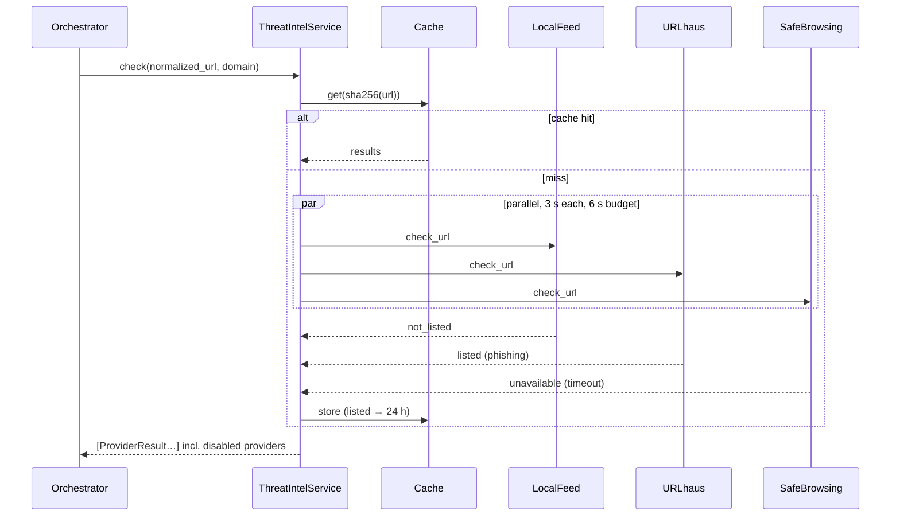

# Threat-Intelligence Architecture

## 1. Principles

1. **Pluggable:** each source is a `ThreatIntelProvider`, enabled or disabled independently by env vars.
2. **Never crash:** a failing provider returns `unavailable` or `error`, and local analysis continues.
3. **Never over-claim:** `not_listed` means *not in that database*, and the UI states this. The system
   reports exactly which sources were checked.
4. **Privacy:** prefer **local feeds**, which make no per-request call, so user URLs are not sent to
   third parties. API lookups send the URL (or its hash, for VirusTotal) to that provider, and the
   privacy notice discloses it. **We never *submit* URLs for scanning.** VirusTotal submissions become
   visible to its community.
5. **Quota-safe:** TTL cache, per-provider timeouts, and one overall time budget.

## 2. Interface

```python
class TIStatus(str, Enum):
    LISTED = "listed"; NOT_LISTED = "not_listed"; UNAVAILABLE = "unavailable"
    DISABLED = "disabled"; ERROR = "error"

@dataclass
class ProviderResult:
    provider: str
    status: TIStatus
    threat_type: str | None = None     # "phishing", "malware_download", ...
    detail: str | None = None          # short, safe to show ("timeout", "3/94 engines")
    checked_at: datetime | None = None

class ThreatIntelProvider(ABC):
    name: str
    def is_enabled(self) -> bool: ...
    @abstractmethod
    def check_url(self, normalized_url: str, domain: str) -> ProviderResult: ...

class ThreatIntelService:
    def __init__(self, providers: list[ThreatIntelProvider], cache, budget_s: float = 6.0): ...
    def check(self, normalized_url: str, domain: str) -> list[ProviderResult]:
        # 1. cache lookup (key = sha256(normalized_url))
        # 2. run enabled providers in a ThreadPoolExecutor, each with its own timeout
        # 3. anything not finished within the budget → UNAVAILABLE("timeout")
        # 4. disabled providers reported as DISABLED (so the UI can show coverage)
        # 5. cache: listed → 24 h, not_listed → 1 h, unavailable → not cached
```

The scoring engine maps results to indicators: `TI_LISTED`, `TI_PARTIAL` or `TI_UNAVAILABLE`.

## 3. Providers

| Provider | Access | Key / env var | Free-tier notes | MVP status |
|---|---|---|---|---|
| **Local feed** (OpenPhish community feed + URLhaus recent-URL dump + `demo_blocklist.txt`) | Downloaded into memory at startup and refreshed every 6–12 h | none (`TI_LOCAL_FEEDS_ENABLED=true`) | Community feeds are for non-commercial use. Coverage is limited to recent entries. | **Enabled by default** |
| **URLhaus API** (abuse.ch) | `POST https://urlhaus-api.abuse.ch/v1/url/` with an `Auth-Key` header | `URLHAUS_AUTH_KEY` | abuse.ch now requires a free Auth-Key. Get it from their auth portal. | Enabled if key set |
| **Google Safe Browsing** Lookup API | `threatMatches:find` | `GOOGLE_SAFE_BROWSING_API_KEY` | Free for non-commercial use. Needs a Google Cloud project. Confirm the current API version (v4/v5) when implementing. | Enabled if key set |
| **VirusTotal** v3 | `GET /api/v3/urls/{url_id}` (**lookup only**) | `VIRUSTOTAL_API_KEY` | Public API: about 4 req/min and 500/day, non-commercial. Returns 404 if VT has never seen the URL, which we map to `not_listed`. | Enabled if key set |
| **PhishTank** | `checkurl` endpoint | `PHISHTANK_API_KEY` | **New registrations have been unavailable for a long time.** Only usable if a team member already has a key. | Optional, disabled by default |
| **RDAP** (domain age, not reputation) | `https://rdap.org/domain/{domain}` | none | Best-effort. Many ccTLDs don't publish creation dates, which we report as `unavailable`. | Enabled, used by `domain_age.py` |

> The quotas and terms above must be re-checked on each provider's website in Week 7. The code must
> not rely on any figure written here.

## 4. Mapping rules

| Provider response | Our status |
|---|---|
| URLhaus `query_status: ok` with `url_status` online/offline | `listed` (`threat_type` from its `threat` field) |
| URLhaus `no_results` | `not_listed` |
| GSB non-empty `matches` | `listed` (`threat_type` = `threatType`) |
| GSB empty `{}` | `not_listed` |
| VT `malicious + phishing ≥ 3` | `listed` · `1–2` → `listed` with detail, mapped to `TI_PARTIAL` · `0` → `not_listed` · HTTP 404 → `not_listed` |
| HTTP 429 / 5xx / timeout / DNS failure | `unavailable` |
| HTTP 401/403 (bad key) | `error` ("configuration"), logged once without the key |

## 5. Demo without live malicious URLs

- `demo_blocklist.txt` contains **only** reserved-TLD entries (`*.test`, `*.example`, RFC 2606), e.g.
  `http://secure-sbi-kyc-update.example/login`. These can never resolve to a real site.
- Google publishes Safe Browsing **test URLs** (e.g. `testsafebrowsing.appspot.com`) that are
  intentionally flagged. We use those to show a real `listed` response from GSB.
- We **do not** copy live malware URLs from URLhaus into the repository.

## 6. Sequence


