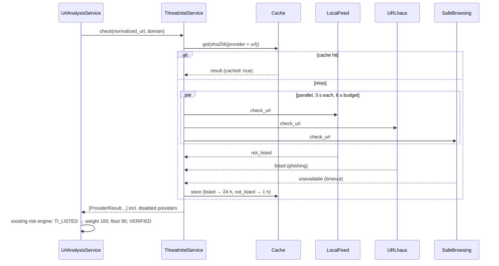

# Threat-Intelligence Architecture (implemented)

Code: `backend/app/threat_intelligence/` (`base.py`, `service.py`, `cache.py`, `http.py`,
`factory.py`, `feeds.py`, `providers/`). Threat intelligence (TI) is one step of the existing URL
pipeline (`UrlAnalysisService`), so every link that QRGUARD analyses is checked the same way,
whether it was typed as a URL, found in a message or screenshot, or decoded from a QR code.
There is no separate TI scoring: results become the `TI_LISTED` / `TI_PARTIAL` indicators of the
existing risk engine (see risk-scoring §3.2 and §5).

## 1. Principles

1. **Pluggable:** each source is a `ThreatIntelProvider`, enabled or disabled independently by env vars.
2. **Never crash:** a failing provider returns `unavailable` or `error`, and local analysis continues.
3. **Never over-claim:** `not_listed` means *not in that database*, and the response states this. It
   never lowers a score and never verifies anything. The system reports exactly which sources were
   checked, including the disabled ones.
4. **Privacy:** **local feeds** are the default and make no per-request call, so user URLs are not
   sent to third parties. An API lookup sends **only the normalised URL** (VirusTotal: the URL's
   base64 identifier) to that provider: no message text, no IP address, no user or request id.
   **We never *submit* URLs for scanning** (VirusTotal submissions become visible to its community).
5. **Quota-safe:** TTL cache, per-provider timeouts, one overall time budget, and a VirusTotal
   lookup quota.

## 2. Interface

```python
class TIStatus(StrEnum):
    LISTED, PARTIAL, NOT_LISTED, UNAVAILABLE, DISABLED, ERROR

@dataclass(frozen=True)
class ProviderResult:
    provider: str
    status: TIStatus
    threat_type: str | None = None   # "phishing", "malware_download", ...
    detail: str | None = None        # short and safe to show: "timeout", "5/94 engines"
    limited: bool = False            # demo blocklist only (see §5)
    cached: bool = False

class ThreatIntelProvider(ABC):
    name: str
    external: bool                    # sends the URL to a third party
    def is_enabled(self) -> bool: ...
    @abstractmethod
    def check_url(self, normalized_url: str, domain: str) -> ProviderResult: ...

class ThreatIntelService:
    def check(self, normalized_url: str, domain: str) -> list[ProviderResult]:
        # 1. disabled providers -> DISABLED (never called)
        # 2. cache lookup per provider (key = sha256(provider + URL))
        # 3. the rest run in parallel threads, each with its own network timeout
        # 4. not finished within the budget -> UNAVAILABLE ("timeout")
        # 5. a provider that raises -> UNAVAILABLE (logged without URL or key)
        # 6. cache: listed/partial 24 h, not_listed 1 h, failures never cached
```

The URL analyzer checks the normalised URL and, for shortened links, also the final destination.

## 3. Providers

| Provider | Access | Env var | Default |
|---|---|---|---|
| **Local feed** (`local_feed`) | In-memory sets: `app/data/threat_feeds/demo_blocklist.txt` plus every `*.txt` in `THREAT_INTEL_FEED_DIR` (e.g. OpenPhish and URLhaus plain-text dumps) | `THREAT_INTEL_LOCAL_FEEDS_ENABLED` (true), `THREAT_INTEL_FEED_DIR` | **Enabled** |
| **URLhaus** (`urlhaus`) | `POST https://urlhaus-api.abuse.ch/v1/url/`, `Auth-Key` header, form field `url` | `URLHAUS_AUTH_KEY` | Enabled if key set |
| **Google Safe Browsing** (`google_safe_browsing`) | Lookup API v4 `threatMatches:find` (MALWARE, SOCIAL_ENGINEERING, UNWANTED_SOFTWARE, POTENTIALLY_HARMFUL_APPLICATION) | `GOOGLE_SAFE_BROWSING_API_KEY` | Enabled if key set |
| **VirusTotal** (`virustotal`) | `GET /api/v3/urls/{url_id}`, `x-apikey` header, **lookup only**, max 4 lookups/min per process | `VIRUSTOTAL_API_KEY` | Enabled if key set |
| **PhishTank** (`phishtank`) | `POST https://checkurl.phishtank.com/checkurl/` | `PHISHTANK_API_KEY` | Enabled if key set (new registrations are closed; only for an existing key) |

Local feed file format: one entry per line, `#` starts a comment. A full URL is matched exactly
after the same normalisation as user input. A bare host name matches that host and its
subdomains (`upi-refund-desk.example` matches `pay.upi-refund-desk.example`, not
`upi-refund-desk.example.org`). Unparseable lines are skipped. Files over 50 MB are ignored.

Downloading feeds (not done at startup, so startup never depends on the network):

```bash
THREAT_INTEL_FEED_DIR=/data/feeds flask --app wsgi ti-update-feeds   # then restart the app
```

It downloads `openphish.txt` (OpenPhish community feed) and `urlhaus_recent.txt` (URLhaus recent
URLs), max 50 MB each, written atomically. A failed download keeps the previous file. Check each
feed's terms of use (community feeds are for non-commercial use) before deploying.

> Quotas and terms of the external services change. Check them on each provider's website before a
> deployment. The code does not rely on any quota except the conservative VirusTotal guard.

## 4. Mapping rules

| Provider response | Our status |
|---|---|
| Local feed: URL or host in a list | `listed` (`threat_type: "blocklist"`) |
| URLhaus `query_status: ok` | `listed` (`threat_type` from `threat`, `detail: "url_status: online/offline"`) |
| URLhaus `no_results` / `invalid_url` | `not_listed` |
| GSB non-empty `matches` | `listed` (`threat_type`: phishing, malware, unwanted_software, harmful_application) |
| GSB `{}` | `not_listed` |
| VirusTotal ≥ 3 engines `malicious` | `listed` (`detail: "5/94 engines"`) |
| VirusTotal 1–2 `malicious`, or ≥ 3 `suspicious` | `partial` → `TI_PARTIAL` (weaker, never verifies) |
| VirusTotal otherwise, or HTTP 404 (never seen) | `not_listed` |
| PhishTank in database + verified | `listed` (phishing) · in database, unverified → `partial` · otherwise `not_listed` |
| HTTP 429, 5xx, timeout, DNS/TLS/network failure | `unavailable` |
| HTTP 401/403 (bad key) | `error` (`detail: "configuration"`), logged without the key |
| Any other status, non-JSON body, unexpected fields | `unavailable` (`detail: "unexpected response"`), **never** `not_listed` |
| No API key | `disabled` (no request is made) |

Scoring (existing engine, unchanged): any `listed` → `TI_LISTED` (weight 100, **floor 90**,
VERIFIED by `threat_intelligence`). Otherwise any `partial` → `TI_PARTIAL` (weight 50, not a
verification). `not_listed`, `unavailable`, `error` and `disabled` add nothing. So when providers
disagree, one confirmed listing is enough, and a missing or failed check can never make a link
look safer than local analysis says.

## 5. Demo without live malicious URLs

- `app/data/threat_feeds/demo_blocklist.txt` contains **only** reserved names (`.example`, `.test`,
  RFC 2606 / 6761), e.g. `http://secure-sbi-kyc-update.example/login` and the host
  `upi-refund-desk.example`. These can never resolve to a real site. A test enforces this.
- When the demo list is the only local data, local-feed results carry `limited_coverage: true`.
  A limited `not_listed` does **not** raise confidence, and the note says "Only QRGUARD's small
  demo blocklist could be checked". A hit is still a real TI hit (that is its purpose in demos).
- Google publishes Safe Browsing test URLs (e.g. on `testsafebrowsing.appspot.com`) for a live
  `listed` demo when a GSB key is configured.
- We **do not** copy live malware URLs into the repository.

## 6. Response and health

Every analysis response has:

```json
"threat_intel": {
  "checked": true,
  "providers": [
    { "provider": "local_feed", "status": "listed", "threat_type": "blocklist", "limited_coverage": true },
    { "provider": "urlhaus", "status": "not_listed", "cached": true },
    { "provider": "google_safe_browsing", "status": "unavailable", "detail": "timeout" },
    { "provider": "virustotal", "status": "disabled" },
    { "provider": "phishtank", "status": "disabled" }
  ],
  "note": "Not being listed in a threat database does not mean a link is safe."
}
```

`GET /api/health` → `components.threat_intel`:
`{ "enabled": true, "providers": [ { "provider": "urlhaus", "enabled": false, "external": true }, … ] }`.
It shows only on/off, never keys or feed paths.

## 7. Configuration (env vars, all optional)

| Variable | Default | Meaning |
|---|---|---|
| `THREAT_INTEL_LOCAL_FEEDS_ENABLED` | `true` | Local feed provider on/off |
| `THREAT_INTEL_FEED_DIR` | (none) | Folder with downloaded `*.txt` feeds |
| `THREAT_INTEL_TIMEOUT_SECONDS` | `3` (1–10) | Network timeout per provider request |
| `THREAT_INTEL_BUDGET_SECONDS` | `6` (1–20) | Time budget for all providers together |
| `THREAT_INTEL_CACHE_LISTED_SECONDS` | `86400` | Cache time for `listed`/`partial` |
| `THREAT_INTEL_CACHE_NOT_LISTED_SECONDS` | `3600` | Cache time for `not_listed` |
| `URLHAUS_AUTH_KEY`, `GOOGLE_SAFE_BROWSING_API_KEY`, `VIRUSTOTAL_API_KEY`, `PHISHTANK_API_KEY` | (none) | Provider keys; empty = provider disabled |

Keys are read from the environment only (Render dashboard / local `.env`, never committed). They
are validated for format at startup (the error never shows the value), excluded from the Config
`repr`, and never logged or returned.

## 8. Sequence



## 9. Known limitations

- **Coverage.** Without API keys or downloaded feeds, only the tiny demo list is checked. Even with
  every provider, new phishing sites are often unlisted for hours: absence proves nothing.
- **Exact URL matching.** Feeds list specific URLs; the same phishing kit on another path or domain
  is not matched (only bare-host entries cover subdomains).
- **Feed freshness.** Feeds are loaded at startup; run `ti-update-feeds` and restart to refresh.
  On Render's free tier this has to be part of the deploy (Phase 12).
- **Per-process state.** The cache and the VirusTotal quota are per worker process (in memory).
- **Third-party lookups disclose the URL** to that provider (never the message around it). Only
  enable the external providers the privacy notice covers.
- **Provider terms.** Community feeds and free API tiers are for non-commercial use.
- **PhishTank** keys cannot currently be obtained by new users.
- **Timeouts** add latency: a slow provider can add up to `THREAT_INTEL_BUDGET_SECONDS` (6 s) to an
  analysis; its result is then `unavailable`.
